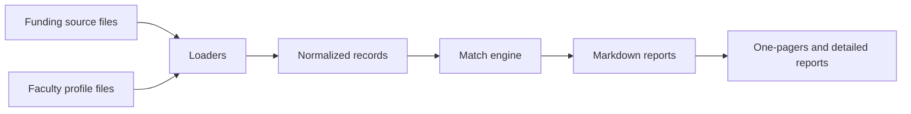

# Architecture

`funding-compiler` uses a small pipeline that can be inspected and extended without a database or hosted service.

## Components

- `models.py` defines the opportunity, faculty, and match records.
- `loaders.py` reads CSV or YAML files and normalizes keyword fields.
- `matching.py` scores opportunity-faculty fit with a transparent keyword-overlap baseline.
- `reports.py` renders Markdown reports for review, conversion, or downstream publishing.
- `cli.py` exposes demo and matching workflows.

## Extension Points

Future source adapters can create the same normalized opportunity records from federal APIs, foundation websites, company pages, or manually curated spreadsheets. Future matchers can add semantic embeddings, eligibility rules, sponsor preferences, or human review feedback while preserving the same report interface.
