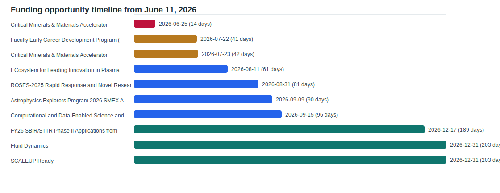

# Current Funding Opportunity Screening

Snapshot date: 2026-06-11

This screening is a curated scan of active or actionable opportunities from the source registry. Sponsor pages remain authoritative, and internal eligibility, cost share, and routing should be verified before action.

## Priority View

| Urgency | Sponsor | Program | Deadline | Top aligned faculty/labs |
| --- | --- | --- | --- | --- |
| urgent | U.S. Department of Energy | [Critical Minerals & Materials Accelerator Topic Area 2](https://eere-exchange.energy.gov/Default.aspx?Search=3589&SearchType=) | 2026-06-25 | David Huitink, Min Zou, Xiangbo Meng |
| soon | National Science Foundation | [Faculty Early Career Development Program (CAREER)](https://www.nsf.gov/funding/opportunities/career-faculty-early-career-development-program) | 2026-07-22 | Manual review |
| soon | U.S. Department of Energy | [Critical Minerals & Materials Accelerator Topic Area 3](https://eere-exchange.energy.gov/Default.aspx?Search=3589&SearchType=) | 2026-07-23 | Xiangbo Meng, Darin Nutter, Min Zou |
| planning | National Science Foundation | [ECosystem for Leading Innovation in Plasma Science and Engineering (ECLIPSE)](https://www.nsf.gov/funding/opportunities/eclipse-ecosystem-leading-innovation-plasma-science-engineering) | 2026-08-11 | David Huitink, Min Zou, Wenchao Zhou |
| planning | NASA | [ROSES-2025 Rapid Response and Novel Research in Earth Science](https://simpler.grants.gov/opportunity/f412520b-5594-4ff2-ae51-9de1b8d8efef) | 2026-08-31 | Neelakshi Majumdar, Anthony Gunderman |
| planning | NASA | [Astrophysics Explorers Program 2026 SMEX AO](https://science.nasa.gov/researchers/sara/grant-solicitations/) | 2026-09-09 | Neelakshi Majumdar, Anthony Gunderman, David Jensen |
| planning | National Science Foundation | [Computational and Data-Enabled Science and Engineering (CDS&E)](https://www.nsf.gov/funding/opportunities/cdse-computational-data-enabled-science-engineering) | 2026-09-15 | David Jensen, David Huitink, Han Hu |
| watch | U.S. Department of Energy Office of Science | [FY26 SBIR/STTR Phase II Applications from FY26 Phase I Awards](https://science.osti.gov/grants/FOAs/Open) | 2026-12-17 | David Huitink, Han Hu, Min Zou |
| watch | National Science Foundation | [Fluid Dynamics](https://www.nsf.gov/funding/opportunities/fluid-dynamics) | 2026-12-31 | Han Hu, David Jensen |
| watch | ARPA-E | [SCALEUP Ready](https://arpa-e-foa.energy.gov/Default.aspx?Search=CONNECT&SearchType=) | 2026-12-31 | Manual review |

## Opportunity Notes

### Critical Minerals & Materials Accelerator Topic Area 2

- Sponsor: U.S. Department of Energy
- Deadline: 2026-06-25 (14 days from snapshot)
- Urgency: urgent
- Summary: Processes to refine and alloy gallium, gallium nitride, germanium, and silicon carbide for semiconductor applications.
- Notes: Verified June 11 2026. Very near-term deadline; likely requires rapid teaming and industry/national lab relevance.
- Top matches:
  - David Huitink: score 0.571; terms: advanced materials, manufacturing, process technology, semiconductors
  - Min Zou: score 0.429; terms: advanced materials, critical materials, manufacturing
  - Xiangbo Meng: score 0.429; terms: advanced materials, critical materials, semiconductors

### Faculty Early Career Development Program (CAREER)

- Sponsor: National Science Foundation
- Deadline: 2026-07-22 (41 days from snapshot)
- Urgency: soon
- Summary: NSF-wide early-career award supporting integrated research and education plans across engineering and science directorates.
- Notes: Verified June 11 2026. Strong fit only for eligible untenured tenure-track faculty.
- Top matches:

### Critical Minerals & Materials Accelerator Topic Area 3

- Sponsor: U.S. Department of Energy
- Deadline: 2026-07-23 (42 days from snapshot)
- Urgency: soon
- Summary: Cost-competitive direct lithium extraction, separation, processing, and related geothermal brine or volcanic-hosted critical materials topics.
- Notes: Verified June 11 2026. More planning runway than Topic Area 2 but still urgent.
- Top matches:
  - Xiangbo Meng: score 0.286; terms: critical materials, lithium extraction
  - Darin Nutter: score 0.143; terms: technoeconomic analysis
  - Min Zou: score 0.143; terms: critical materials

### ECosystem for Leading Innovation in Plasma Science and Engineering (ECLIPSE)

- Sponsor: National Science Foundation
- Deadline: 2026-08-11 (61 days from snapshot)
- Urgency: planning
- Summary: Cross-disciplinary plasma science and engineering ecosystem opportunity with CMMI/CBET/ECCS windows and EPSCoR-related components.
- Notes: Verified June 11 2026. Include only if a credible plasma/high-temperature/aerospace angle exists.
- Top matches:
  - David Huitink: score 0.286; terms: manufacturing, materials
  - Min Zou: score 0.286; terms: manufacturing, materials
  - Wenchao Zhou: score 0.286; terms: manufacturing, materials

### ROSES-2025 Rapid Response and Novel Research in Earth Science

- Sponsor: NASA
- Deadline: 2026-08-31 (81 days from snapshot)
- Urgency: planning
- Summary: NASA Earth Science rapid response and novel research mechanism with no fixed proposal due date; close date shown as last day to submit under ROSES-25 rules.
- Notes: Screened from Simpler Grants.gov and NASA ROSES context. Verify specific ROSES element text before action.
- Top matches:
  - Neelakshi Majumdar: score 0.250; terms: nasa, sensing
  - Anthony Gunderman: score 0.125; terms: sensing

### Astrophysics Explorers Program 2026 SMEX AO

- Sponsor: NASA
- Deadline: 2026-09-09 (90 days from snapshot)
- Urgency: planning
- Summary: NASA Astrophysics Small Explorer mission opportunity; mostly aerospace/space systems rather than ordinary single-PI research.
- Notes: Verified June 11 2026. Low direct fit for most MEEG faculty except aerospace/systems/instrumentation teams.
- Top matches:
  - Neelakshi Majumdar: score 0.667; terms: aerospace systems, mission design, nasa, systems engineering
  - Anthony Gunderman: score 0.333; terms: aerospace systems, systems engineering
  - David Jensen: score 0.167; terms: systems engineering

### Computational and Data-Enabled Science and Engineering (CDS&E)

- Sponsor: National Science Foundation
- Deadline: 2026-09-15 (96 days from snapshot)
- Urgency: planning
- Summary: Computational and data-enabled research across science and engineering, including CBET and CMMI participation.
- Notes: Verified June 11 2026. Window is September 1-15 for CBET/CMMI.
- Top matches:
  - David Jensen: score 0.375; terms: ai, computational modeling, data-enabled science
  - David Huitink: score 0.250; terms: manufacturing, materials
  - Han Hu: score 0.250; terms: ai, machine learning

### FY26 SBIR/STTR Phase II Applications from FY26 Phase I Awards

- Sponsor: U.S. Department of Energy Office of Science
- Deadline: 2026-12-17 (189 days from snapshot)
- Urgency: watch
- Summary: DOE Office of Science SBIR/STTR Phase II opportunity; useful for faculty-industry teams and commercialization pathways rather than ordinary university-led proposals.
- Notes: Verified June 11 2026. Track for faculty with company partners; not a standard university PI opportunity.
- Top matches:
  - David Huitink: score 0.125; terms: materials
  - Han Hu: score 0.125; terms: instrumentation
  - Min Zou: score 0.125; terms: materials

### Fluid Dynamics

- Sponsor: National Science Foundation
- Deadline: 2026-12-31 (203 days from snapshot)
- Urgency: watch
- Summary: Fundamental fluid dynamics research using experimental, theoretical, computational, AI/ML, instrumentation, diagnostics, wind/ocean energy, FSI, turbulence, bubble dynamics, and micro/nanofluidics approaches.
- Notes: Accepted anytime. Deadline field uses 2026-12-31 only for chart placement; proposals can be submitted throughout the year.
- Top matches:
  - Han Hu: score 0.600; terms: ai, bubble dynamics, flow diagnostics, instrumentation, machine learning, multiphase flow
  - David Jensen: score 0.100; terms: ai

### SCALEUP Ready

- Sponsor: ARPA-E
- Deadline: 2026-12-31 (203 days from snapshot)
- Urgency: watch
- Summary: Open-ended scale-up mechanism for promising energy technologies moving toward early commercial products.
- Notes: Accepted anytime while open. Deadline field uses 2026-12-31 only for chart placement.
- Top matches:
