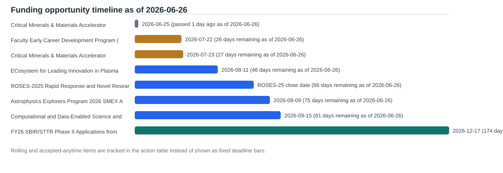

# Current Funding Opportunity Screening

Snapshot date: 2026-06-11
Report refreshed: 2026-06-29

This screening is a curated scan of active or actionable opportunities from the source registry. Sponsor pages remain authoritative, and internal eligibility, cost share, and routing should be verified before action.

## Decision Summary

- Opportunities screened: 10
- Active opportunities: 9
- Passed public deadlines: 1
- Faculty alignments found: 35
- Urgent or overdue action items: 0
- Internal review dates already overdue: 0
- Active opportunities needing sponsor-source recheck: 9
- Oldest active source verification age: 18 days
- Rolling or accepted-anytime items tracked separately: 2

## Faculty Action Inbox

| Action status | Sponsor | Program | Public deadline | Source verification | Internal review by | Match evidence | Next action |
| --- | --- | --- | --- | --- | --- | --- | --- |
| soon | National Science Foundation | [Faculty Early Career Development Program (CAREER)](https://www.nsf.gov/funding/opportunities/career-faculty-early-career-development-program) | 2026-07-22; 23 days remaining as of 2026-06-29 | Last checked 2026-06-11; 18 days old; recheck before action | 2026-07-01 | Manual review | Identify eligible untenured tenure-track faculty, confirm the relevant NSF directorate window, and start the education-integration outline before committing proposal-development time. |
| soon | U.S. Department of Energy | [Critical Minerals & Materials Accelerator Topic Area 3](https://eere-exchange.energy.gov/Default.aspx?Search=3589&SearchType=) | 2026-07-23; 24 days remaining as of 2026-06-29 | Last checked 2026-06-11; 18 days old; recheck before action | 2026-07-02 | Xiangbo Meng (promising, score 0.286): critical materials, lithium extraction; Darin Nutter (exploratory, score 0.143): technoeconomic analysis; Min Zou (exploratory, score 0.143): critical materials | Convene critical-materials, separations, geothermal, and technoeconomic-analysis candidates for a one-hour fit check. |
| planning | National Science Foundation | [ECosystem for Leading Innovation in Plasma Science and Engineering (ECLIPSE)](https://www.nsf.gov/funding/opportunities/eclipse-ecosystem-leading-innovation-plasma-science-engineering) | 2026-08-11; 43 days remaining as of 2026-06-29 | Last checked 2026-06-11; 18 days old; recheck before action | 2026-07-15 | David Huitink (promising, score 0.286): manufacturing, materials; Min Zou (promising, score 0.286): manufacturing, materials; Wenchao Zhou (promising, score 0.286): manufacturing, materials | Confirm whether any MEEG team has a credible plasma, high-temperature, aerospace, or materials-processing angle before outreach. |
| planning | NASA | [ROSES-2025 Rapid Response and Novel Research in Earth Science](https://simpler.grants.gov/opportunity/f412520b-5594-4ff2-ae51-9de1b8d8efef) | ROSES-25 close date; 63 days remaining as of 2026-06-29 | Last checked 2026-06-11; 18 days old; recheck before action | 2026-08-01 | Neelakshi Majumdar (promising, score 0.250): nasa, sensing; Anthony Gunderman (exploratory, score 0.125): sensing | Read the specific ROSES element before contacting faculty; only forward if the rapid-response mechanism matches an active earth-science event or dataset. |
| planning | NASA | [Astrophysics Explorers Program 2026 SMEX AO](https://science.nasa.gov/researchers/sara/grant-solicitations/) | 2026-09-09; 72 days remaining as of 2026-06-29 | Last checked 2026-06-11; 18 days old; recheck before action | 2026-07-01 | Neelakshi Majumdar (strong, score 0.667): aerospace systems, mission design, nasa, systems engineering; Anthony Gunderman (promising, score 0.333): aerospace systems, systems engineering; David Jensen (exploratory, score 0.167): systems engineering | Treat as a strategic aerospace/systems opportunity; verify NOI requirements and whether UArk has a realistic mission-team role. |
| planning | National Science Foundation | [Computational and Data-Enabled Science and Engineering (CDS&E)](https://www.nsf.gov/funding/opportunities/cdse-computational-data-enabled-science-engineering) | 2026-09-15; 78 days remaining as of 2026-06-29 | Last checked 2026-06-11; 18 days old; recheck before action | 2026-08-15 | David Jensen (promising, score 0.375): ai, computational modeling, data-enabled science; David Huitink (promising, score 0.250): manufacturing, materials; Han Hu (promising, score 0.250): ai, machine learning | Identify projects where computation or data-enabled methods are the intellectual core, not only a tool layered onto another proposal. |
| watch | U.S. Department of Energy Office of Science | [FY26 SBIR/STTR Phase II Applications from FY26 Phase I Awards](https://science.osti.gov/grants/FOAs/Open) | 2026-12-17; 171 days remaining as of 2026-06-29 | Last checked 2026-06-11; 18 days old; recheck before action | 2026-11-17 | David Huitink (exploratory, score 0.125): materials; Han Hu (exploratory, score 0.125): instrumentation; Min Zou (exploratory, score 0.125): materials | Forward only to faculty with eligible small-business partners that hold relevant FY26 Phase I awards. |
| accepted anytime | National Science Foundation | [Fluid Dynamics](https://www.nsf.gov/funding/opportunities/fluid-dynamics) | Accepted anytime; no fixed deadline | Last checked 2026-06-11; 18 days old; recheck before action | Not set | Han Hu (strong, score 0.600): ai, bubble dynamics, flow diagnostics, instrumentation, machine learning; +1 more; David Jensen (exploratory, score 0.100): ai | Use as a standing target for mature fluid-dynamics concepts; schedule program-director contact once a two-page concept is ready. |
| rolling | ARPA-E | [SCALEUP Ready](https://arpa-e-foa.energy.gov/Default.aspx?Search=CONNECT&SearchType=) | Rolling while open | Last checked 2026-06-11; 18 days old; recheck before action | Not set | Manual review | Track for faculty with prior ARPA-E or energy-technology commercialization partners rather than broad distribution. |

## Source Recheck Queue

| Sponsor | Program | Last checked | Age | Recheck reason |
| --- | --- | --- | ---: | --- |
| National Science Foundation | [Faculty Early Career Development Program (CAREER)](https://www.nsf.gov/funding/opportunities/career-faculty-early-career-development-program) | 2026-06-11 | 18 | Older than 14 days; verify sponsor page before faculty outreach. |
| U.S. Department of Energy | [Critical Minerals & Materials Accelerator Topic Area 3](https://eere-exchange.energy.gov/Default.aspx?Search=3589&SearchType=) | 2026-06-11 | 18 | Older than 14 days; verify sponsor page before faculty outreach. |
| National Science Foundation | [ECosystem for Leading Innovation in Plasma Science and Engineering (ECLIPSE)](https://www.nsf.gov/funding/opportunities/eclipse-ecosystem-leading-innovation-plasma-science-engineering) | 2026-06-11 | 18 | Older than 14 days; verify sponsor page before faculty outreach. |
| NASA | [ROSES-2025 Rapid Response and Novel Research in Earth Science](https://simpler.grants.gov/opportunity/f412520b-5594-4ff2-ae51-9de1b8d8efef) | 2026-06-11 | 18 | Older than 14 days; verify sponsor page before faculty outreach. |
| NASA | [Astrophysics Explorers Program 2026 SMEX AO](https://science.nasa.gov/researchers/sara/grant-solicitations/) | 2026-06-11 | 18 | Older than 14 days; verify sponsor page before faculty outreach. |
| National Science Foundation | [Computational and Data-Enabled Science and Engineering (CDS&E)](https://www.nsf.gov/funding/opportunities/cdse-computational-data-enabled-science-engineering) | 2026-06-11 | 18 | Older than 14 days; verify sponsor page before faculty outreach. |
| U.S. Department of Energy Office of Science | [FY26 SBIR/STTR Phase II Applications from FY26 Phase I Awards](https://science.osti.gov/grants/FOAs/Open) | 2026-06-11 | 18 | Older than 14 days; verify sponsor page before faculty outreach. |
| National Science Foundation | [Fluid Dynamics](https://www.nsf.gov/funding/opportunities/fluid-dynamics) | 2026-06-11 | 18 | Older than 14 days; verify sponsor page before faculty outreach. |
| ARPA-E | [SCALEUP Ready](https://arpa-e-foa.energy.gov/Default.aspx?Search=CONNECT&SearchType=) | 2026-06-11 | 18 | Older than 14 days; verify sponsor page before faculty outreach. |

## Deadline Timeline

## Priority View

| Urgency | Sponsor | Program | Deadline | Top aligned faculty/labs | Risk notes |
| --- | --- | --- | --- | --- | --- |
| soon | National Science Foundation | [Faculty Early Career Development Program (CAREER)](https://www.nsf.gov/funding/opportunities/career-faculty-early-career-development-program) | 2026-07-22; 23 days remaining as of 2026-06-29 | Manual review | Only eligible early-career faculty can lead; fit is not keyword-specific and should be reviewed manually against the PI's long-term research and education plan. |
| soon | U.S. Department of Energy | [Critical Minerals & Materials Accelerator Topic Area 3](https://eere-exchange.energy.gov/Default.aspx?Search=3589&SearchType=) | 2026-07-23; 24 days remaining as of 2026-06-29 | Xiangbo Meng, Darin Nutter, Min Zou | Cost share, feedstock access, and partner credibility should be verified before faculty invest proposal time. |
| planning | National Science Foundation | [ECosystem for Leading Innovation in Plasma Science and Engineering (ECLIPSE)](https://www.nsf.gov/funding/opportunities/eclipse-ecosystem-leading-innovation-plasma-science-engineering) | 2026-08-11; 43 days remaining as of 2026-06-29 | David Huitink, Min Zou, Wenchao Zhou | Keyword overlap around materials and manufacturing may overstate fit without real plasma-science expertise. |
| planning | NASA | [ROSES-2025 Rapid Response and Novel Research in Earth Science](https://simpler.grants.gov/opportunity/f412520b-5594-4ff2-ae51-9de1b8d8efef) | ROSES-25 close date; 63 days remaining as of 2026-06-29 | Neelakshi Majumdar, Anthony Gunderman | The close date is not the same as a normal proposal deadline, and direct MEEG fit appears narrow. |
| planning | NASA | [Astrophysics Explorers Program 2026 SMEX AO](https://science.nasa.gov/researchers/sara/grant-solicitations/) | 2026-09-09; 72 days remaining as of 2026-06-29 | Neelakshi Majumdar, Anthony Gunderman, David Jensen | Mission-scale AO is unlikely to be a standard single-PI research proposal. |
| planning | National Science Foundation | [Computational and Data-Enabled Science and Engineering (CDS&E)](https://www.nsf.gov/funding/opportunities/cdse-computational-data-enabled-science-engineering) | 2026-09-15; 78 days remaining as of 2026-06-29 | David Jensen, David Huitink, Han Hu | Fit should be checked against the participating NSF division and September submission window. |
| watch | U.S. Department of Energy Office of Science | [FY26 SBIR/STTR Phase II Applications from FY26 Phase I Awards](https://science.osti.gov/grants/FOAs/Open) | 2026-12-17; 171 days remaining as of 2026-06-29 | David Huitink, Han Hu, Min Zou | Not a standard university PI opportunity; participation depends on a qualified small-business lead. |
| accepted anytime | National Science Foundation | [Fluid Dynamics](https://www.nsf.gov/funding/opportunities/fluid-dynamics) | Accepted anytime; no fixed deadline | Han Hu, David Jensen | No urgent deadline, so the main risk is treating a broad program page as a call without sharpening the intellectual contribution. |
| rolling | ARPA-E | [SCALEUP Ready](https://arpa-e-foa.energy.gov/Default.aspx?Search=CONNECT&SearchType=) | Rolling while open | Manual review | Eligibility and technology-readiness constraints may exclude ordinary university-led concepts. |

## Passed Deadlines

| Sponsor | Program | Deadline | Source verification | Prior match evidence | Follow-up |
| --- | --- | --- | --- | --- | --- |
| U.S. Department of Energy | [Critical Minerals & Materials Accelerator Topic Area 2](https://eere-exchange.energy.gov/Default.aspx?Search=3589&SearchType=) | 2026-06-25; passed 4 days ago as of 2026-06-29 | Last checked 2026-06-11; 18 days old; recheck before action | David Huitink (strong, score 0.571): advanced materials, manufacturing, process technology, semiconductors; Min Zou (promising, score 0.429): advanced materials, critical materials, manufacturing; Xiangbo Meng (promising, score 0.429): advanced materials, critical materials, semiconductors | Archive for lessons learned or mark as recurring only after the sponsor posts a new cycle. |

## Faculty Briefs

| Faculty | Priority opportunities | Evidence to verify | Suggested follow-up |
| --- | --- | --- | --- |
| Anthony Gunderman | [Astrophysics Explorers Program 2026 SMEX AO](https://science.nasa.gov/researchers/sara/grant-solicitations/) (planning; 2026-09-09; 72 days remaining as of 2026-06-29); [ROSES-2025 Rapid Response and Novel Research in Earth Science](https://simpler.grants.gov/opportunity/f412520b-5594-4ff2-ae51-9de1b8d8efef) (planning; ROSES-25 close date; 63 days remaining as of 2026-06-29) | promising fit, score 0.333, terms: aerospace systems, systems engineering; exploratory fit, score 0.125, terms: sensing | Treat as a strategic aerospace/systems opportunity; verify NOI requirements and whether UArk has a realistic mission-team role. |
| Darin Nutter | [Critical Minerals & Materials Accelerator Topic Area 3](https://eere-exchange.energy.gov/Default.aspx?Search=3589&SearchType=) (soon; 2026-07-23; 24 days remaining as of 2026-06-29) | exploratory fit, score 0.143, terms: technoeconomic analysis | Convene critical-materials, separations, geothermal, and technoeconomic-analysis candidates for a one-hour fit check. |
| David Huitink | [ECosystem for Leading Innovation in Plasma Science and Engineering (ECLIPSE)](https://www.nsf.gov/funding/opportunities/eclipse-ecosystem-leading-innovation-plasma-science-engineering) (planning; 2026-08-11; 43 days remaining as of 2026-06-29); [Computational and Data-Enabled Science and Engineering (CDS&E)](https://www.nsf.gov/funding/opportunities/cdse-computational-data-enabled-science-engineering) (planning; 2026-09-15; 78 days remaining as of 2026-06-29); [FY26 SBIR/STTR Phase II Applications from FY26 Phase I Awards](https://science.osti.gov/grants/FOAs/Open) (watch; 2026-12-17; 171 days remaining as of 2026-06-29) | promising fit, score 0.286, terms: manufacturing, materials; promising fit, score 0.250, terms: manufacturing, materials; exploratory fit, score 0.125, terms: materials | Confirm whether any MEEG team has a credible plasma, high-temperature, aerospace, or materials-processing angle before outreach. |
| David Jensen | [Computational and Data-Enabled Science and Engineering (CDS&E)](https://www.nsf.gov/funding/opportunities/cdse-computational-data-enabled-science-engineering) (planning; 2026-09-15; 78 days remaining as of 2026-06-29); [Astrophysics Explorers Program 2026 SMEX AO](https://science.nasa.gov/researchers/sara/grant-solicitations/) (planning; 2026-09-09; 72 days remaining as of 2026-06-29); [Fluid Dynamics](https://www.nsf.gov/funding/opportunities/fluid-dynamics) (accepted anytime; Accepted anytime; no fixed deadline) | promising fit, score 0.375, terms: ai, computational modeling, data-enabled science; exploratory fit, score 0.167, terms: systems engineering; exploratory fit, score 0.100, terms: ai | Identify projects where computation or data-enabled methods are the intellectual core, not only a tool layered onto another proposal. |
| Han Hu | [Computational and Data-Enabled Science and Engineering (CDS&E)](https://www.nsf.gov/funding/opportunities/cdse-computational-data-enabled-science-engineering) (planning; 2026-09-15; 78 days remaining as of 2026-06-29); [Astrophysics Explorers Program 2026 SMEX AO](https://science.nasa.gov/researchers/sara/grant-solicitations/) (planning; 2026-09-09; 72 days remaining as of 2026-06-29); [Fluid Dynamics](https://www.nsf.gov/funding/opportunities/fluid-dynamics) (accepted anytime; Accepted anytime; no fixed deadline); [FY26 SBIR/STTR Phase II Applications from FY26 Phase I Awards](https://science.osti.gov/grants/FOAs/Open) (watch; 2026-12-17; 171 days remaining as of 2026-06-29) | promising fit, score 0.250, terms: ai, machine learning; exploratory fit, score 0.167, terms: instrumentation; strong fit, score 0.600, terms: ai, bubble dynamics, flow diagnostics, instrumentation, machine learning; exploratory fit, score 0.125, terms: instrumentation | Identify projects where computation or data-enabled methods are the intellectual core, not only a tool layered onto another proposal. |
| Min Zou | [Critical Minerals & Materials Accelerator Topic Area 3](https://eere-exchange.energy.gov/Default.aspx?Search=3589&SearchType=) (soon; 2026-07-23; 24 days remaining as of 2026-06-29); [ECosystem for Leading Innovation in Plasma Science and Engineering (ECLIPSE)](https://www.nsf.gov/funding/opportunities/eclipse-ecosystem-leading-innovation-plasma-science-engineering) (planning; 2026-08-11; 43 days remaining as of 2026-06-29); [Computational and Data-Enabled Science and Engineering (CDS&E)](https://www.nsf.gov/funding/opportunities/cdse-computational-data-enabled-science-engineering) (planning; 2026-09-15; 78 days remaining as of 2026-06-29); [FY26 SBIR/STTR Phase II Applications from FY26 Phase I Awards](https://science.osti.gov/grants/FOAs/Open) (watch; 2026-12-17; 171 days remaining as of 2026-06-29) | exploratory fit, score 0.143, terms: critical materials; promising fit, score 0.286, terms: manufacturing, materials; promising fit, score 0.250, terms: manufacturing, materials; exploratory fit, score 0.125, terms: materials | Convene critical-materials, separations, geothermal, and technoeconomic-analysis candidates for a one-hour fit check. |
| Neelakshi Majumdar | [Astrophysics Explorers Program 2026 SMEX AO](https://science.nasa.gov/researchers/sara/grant-solicitations/) (planning; 2026-09-09; 72 days remaining as of 2026-06-29); [ROSES-2025 Rapid Response and Novel Research in Earth Science](https://simpler.grants.gov/opportunity/f412520b-5594-4ff2-ae51-9de1b8d8efef) (planning; ROSES-25 close date; 63 days remaining as of 2026-06-29) | strong fit, score 0.667, terms: aerospace systems, mission design, nasa, systems engineering; promising fit, score 0.250, terms: nasa, sensing | Treat as a strategic aerospace/systems opportunity; verify NOI requirements and whether UArk has a realistic mission-team role. |
| Paul Millett | [Critical Minerals & Materials Accelerator Topic Area 3](https://eere-exchange.energy.gov/Default.aspx?Search=3589&SearchType=) (soon; 2026-07-23; 24 days remaining as of 2026-06-29); [Computational and Data-Enabled Science and Engineering (CDS&E)](https://www.nsf.gov/funding/opportunities/cdse-computational-data-enabled-science-engineering) (planning; 2026-09-15; 78 days remaining as of 2026-06-29) | exploratory fit, score 0.143, terms: critical materials; promising fit, score 0.250, terms: computational modeling, data-enabled science | Convene critical-materials, separations, geothermal, and technoeconomic-analysis candidates for a one-hour fit check. |
| Wan Shou | [ECosystem for Leading Innovation in Plasma Science and Engineering (ECLIPSE)](https://www.nsf.gov/funding/opportunities/eclipse-ecosystem-leading-innovation-plasma-science-engineering) (planning; 2026-08-11; 43 days remaining as of 2026-06-29); [Computational and Data-Enabled Science and Engineering (CDS&E)](https://www.nsf.gov/funding/opportunities/cdse-computational-data-enabled-science-engineering) (planning; 2026-09-15; 78 days remaining as of 2026-06-29) | exploratory fit, score 0.143, terms: manufacturing; exploratory fit, score 0.125, terms: manufacturing | Confirm whether any MEEG team has a credible plasma, high-temperature, aerospace, or materials-processing angle before outreach. |
| Wenchao Zhou | [ECosystem for Leading Innovation in Plasma Science and Engineering (ECLIPSE)](https://www.nsf.gov/funding/opportunities/eclipse-ecosystem-leading-innovation-plasma-science-engineering) (planning; 2026-08-11; 43 days remaining as of 2026-06-29); [Computational and Data-Enabled Science and Engineering (CDS&E)](https://www.nsf.gov/funding/opportunities/cdse-computational-data-enabled-science-engineering) (planning; 2026-09-15; 78 days remaining as of 2026-06-29); [FY26 SBIR/STTR Phase II Applications from FY26 Phase I Awards](https://science.osti.gov/grants/FOAs/Open) (watch; 2026-12-17; 171 days remaining as of 2026-06-29) | promising fit, score 0.286, terms: manufacturing, materials; promising fit, score 0.250, terms: manufacturing, materials; exploratory fit, score 0.125, terms: materials | Confirm whether any MEEG team has a credible plasma, high-temperature, aerospace, or materials-processing angle before outreach. |
| Xiangbo Meng | [Critical Minerals & Materials Accelerator Topic Area 3](https://eere-exchange.energy.gov/Default.aspx?Search=3589&SearchType=) (soon; 2026-07-23; 24 days remaining as of 2026-06-29); [ECosystem for Leading Innovation in Plasma Science and Engineering (ECLIPSE)](https://www.nsf.gov/funding/opportunities/eclipse-ecosystem-leading-innovation-plasma-science-engineering) (planning; 2026-08-11; 43 days remaining as of 2026-06-29); [FY26 SBIR/STTR Phase II Applications from FY26 Phase I Awards](https://science.osti.gov/grants/FOAs/Open) (watch; 2026-12-17; 171 days remaining as of 2026-06-29) | promising fit, score 0.286, terms: critical materials, lithium extraction; exploratory fit, score 0.143, terms: energy; exploratory fit, score 0.125, terms: energy | Convene critical-materials, separations, geothermal, and technoeconomic-analysis candidates for a one-hour fit check. |

## Opportunity Notes

### Critical Minerals & Materials Accelerator Topic Area 2

- Sponsor: U.S. Department of Energy
- Deadline: 2026-06-25; passed 4 days ago as of 2026-06-29
- Deadline type: fixed
- Internal review by: 2026-06-18 (overdue)
- Verified on: 2026-06-11
- Action status: past due
- Next action: Pursue only if a PI team, partner roles, and cost-share assumptions can be confirmed immediately with the DOE NOFO in hand.
- Risk notes: Very short runway; topic fit depends on semiconductor-materials process capability and likely industry or national-lab relevance.
- Summary: Processes to refine and alloy gallium, gallium nitride, germanium, and silicon carbide for semiconductor applications.
- Notes: Verified June 11 2026. Very near-term deadline; likely requires rapid teaming and industry/national lab relevance.
- Top matches:
  - David Huitink: score 0.571; terms: advanced materials, manufacturing, process technology, semiconductors
  - Min Zou: score 0.429; terms: advanced materials, critical materials, manufacturing
  - Xiangbo Meng: score 0.429; terms: advanced materials, critical materials, semiconductors

### Faculty Early Career Development Program (CAREER)

- Sponsor: National Science Foundation
- Deadline: 2026-07-22; 23 days remaining as of 2026-06-29
- Deadline type: fixed
- Internal review by: 2026-07-01
- Verified on: 2026-06-11
- Action status: soon
- Next action: Identify eligible untenured tenure-track faculty, confirm the relevant NSF directorate window, and start the education-integration outline before committing proposal-development time.
- Risk notes: Only eligible early-career faculty can lead; fit is not keyword-specific and should be reviewed manually against the PI's long-term research and education plan.
- Summary: NSF-wide early-career award supporting integrated research and education plans across engineering and science directorates.
- Notes: Verified June 11 2026. Strong fit only for eligible untenured tenure-track faculty.
- Top matches:

### Critical Minerals & Materials Accelerator Topic Area 3

- Sponsor: U.S. Department of Energy
- Deadline: 2026-07-23; 24 days remaining as of 2026-06-29
- Deadline type: fixed
- Internal review by: 2026-07-02
- Verified on: 2026-06-11
- Action status: soon
- Next action: Convene critical-materials, separations, geothermal, and technoeconomic-analysis candidates for a one-hour fit check.
- Risk notes: Cost share, feedstock access, and partner credibility should be verified before faculty invest proposal time.
- Summary: Cost-competitive direct lithium extraction, separation, processing, and related geothermal brine or volcanic-hosted critical materials topics.
- Notes: Verified June 11 2026. More planning runway than Topic Area 2 but still urgent.
- Top matches:
  - Xiangbo Meng: score 0.286; terms: critical materials, lithium extraction
  - Darin Nutter: score 0.143; terms: technoeconomic analysis
  - Min Zou: score 0.143; terms: critical materials

### ECosystem for Leading Innovation in Plasma Science and Engineering (ECLIPSE)

- Sponsor: National Science Foundation
- Deadline: 2026-08-11; 43 days remaining as of 2026-06-29
- Deadline type: fixed
- Internal review by: 2026-07-15
- Verified on: 2026-06-11
- Action status: planning
- Next action: Confirm whether any MEEG team has a credible plasma, high-temperature, aerospace, or materials-processing angle before outreach.
- Risk notes: Keyword overlap around materials and manufacturing may overstate fit without real plasma-science expertise.
- Summary: Cross-disciplinary plasma science and engineering ecosystem opportunity with CMMI/CBET/ECCS windows and EPSCoR-related components.
- Notes: Verified June 11 2026. Include only if a credible plasma/high-temperature/aerospace angle exists.
- Top matches:
  - David Huitink: score 0.286; terms: manufacturing, materials
  - Min Zou: score 0.286; terms: manufacturing, materials
  - Wenchao Zhou: score 0.286; terms: manufacturing, materials

### ROSES-2025 Rapid Response and Novel Research in Earth Science

- Sponsor: NASA
- Deadline: ROSES-25 close date; 63 days remaining as of 2026-06-29
- Deadline type: window
- Internal review by: 2026-08-01
- Verified on: 2026-06-11
- Action status: planning
- Next action: Read the specific ROSES element before contacting faculty; only forward if the rapid-response mechanism matches an active earth-science event or dataset.
- Risk notes: The close date is not the same as a normal proposal deadline, and direct MEEG fit appears narrow.
- Summary: NASA Earth Science rapid response and novel research mechanism with no fixed proposal due date; close date shown as last day to submit under ROSES-25 rules.
- Notes: Screened from Simpler Grants.gov and NASA ROSES context. Verify specific ROSES element text before action.
- Top matches:
  - Neelakshi Majumdar: score 0.250; terms: nasa, sensing
  - Anthony Gunderman: score 0.125; terms: sensing

### Astrophysics Explorers Program 2026 SMEX AO

- Sponsor: NASA
- Deadline: 2026-09-09; 72 days remaining as of 2026-06-29
- Deadline type: fixed
- Internal review by: 2026-07-01
- Verified on: 2026-06-11
- Action status: planning
- Next action: Treat as a strategic aerospace/systems opportunity; verify NOI requirements and whether UArk has a realistic mission-team role.
- Risk notes: Mission-scale AO is unlikely to be a standard single-PI research proposal.
- Summary: NASA Astrophysics Small Explorer mission opportunity; mostly aerospace/space systems rather than ordinary single-PI research.
- Notes: Verified June 11 2026. Low direct fit for most MEEG faculty except aerospace/systems/instrumentation teams.
- Top matches:
  - Neelakshi Majumdar: score 0.667; terms: aerospace systems, mission design, nasa, systems engineering
  - Anthony Gunderman: score 0.333; terms: aerospace systems, systems engineering
  - David Jensen: score 0.167; terms: systems engineering

### Computational and Data-Enabled Science and Engineering (CDS&E)

- Sponsor: National Science Foundation
- Deadline: 2026-09-15; 78 days remaining as of 2026-06-29
- Deadline type: window
- Internal review by: 2026-08-15
- Verified on: 2026-06-11
- Action status: planning
- Next action: Identify projects where computation or data-enabled methods are the intellectual core, not only a tool layered onto another proposal.
- Risk notes: Fit should be checked against the participating NSF division and September submission window.
- Summary: Computational and data-enabled research across science and engineering, including CBET and CMMI participation.
- Notes: Verified June 11 2026. Window is September 1-15 for CBET/CMMI.
- Top matches:
  - David Jensen: score 0.375; terms: ai, computational modeling, data-enabled science
  - David Huitink: score 0.250; terms: manufacturing, materials
  - Han Hu: score 0.250; terms: ai, machine learning

### FY26 SBIR/STTR Phase II Applications from FY26 Phase I Awards

- Sponsor: U.S. Department of Energy Office of Science
- Deadline: 2026-12-17; 171 days remaining as of 2026-06-29
- Deadline type: fixed
- Internal review by: 2026-11-17
- Verified on: 2026-06-11
- Action status: watch
- Next action: Forward only to faculty with eligible small-business partners that hold relevant FY26 Phase I awards.
- Risk notes: Not a standard university PI opportunity; participation depends on a qualified small-business lead.
- Summary: DOE Office of Science SBIR/STTR Phase II opportunity; useful for faculty-industry teams and commercialization pathways rather than ordinary university-led proposals.
- Notes: Verified June 11 2026. Track for faculty with company partners; not a standard university PI opportunity.
- Top matches:
  - David Huitink: score 0.125; terms: materials
  - Han Hu: score 0.125; terms: instrumentation
  - Min Zou: score 0.125; terms: materials

### Fluid Dynamics

- Sponsor: National Science Foundation
- Deadline: Accepted anytime; no fixed deadline
- Deadline type: accepted anytime
- Internal review by: Not set
- Verified on: 2026-06-11
- Action status: accepted anytime
- Next action: Use as a standing target for mature fluid-dynamics concepts; schedule program-director contact once a two-page concept is ready.
- Risk notes: No urgent deadline, so the main risk is treating a broad program page as a call without sharpening the intellectual contribution.
- Summary: Fundamental fluid dynamics research using experimental, theoretical, computational, AI/ML, instrumentation, diagnostics, wind/ocean energy, FSI, turbulence, bubble dynamics, and micro/nanofluidics approaches.
- Notes: Accepted anytime. Deadline field uses 2026-12-31 only for chart placement; proposals can be submitted throughout the year.
- Top matches:
  - Han Hu: score 0.600; terms: ai, bubble dynamics, flow diagnostics, instrumentation, machine learning, multiphase flow
  - David Jensen: score 0.100; terms: ai

### SCALEUP Ready

- Sponsor: ARPA-E
- Deadline: Rolling while open
- Deadline type: rolling
- Internal review by: Not set
- Verified on: 2026-06-11
- Action status: rolling
- Next action: Track for faculty with prior ARPA-E or energy-technology commercialization partners rather than broad distribution.
- Risk notes: Eligibility and technology-readiness constraints may exclude ordinary university-led concepts.
- Summary: Open-ended scale-up mechanism for promising energy technologies moving toward early commercial products.
- Notes: Accepted anytime while open. Deadline field uses 2026-12-31 only for chart placement.
- Top matches:
