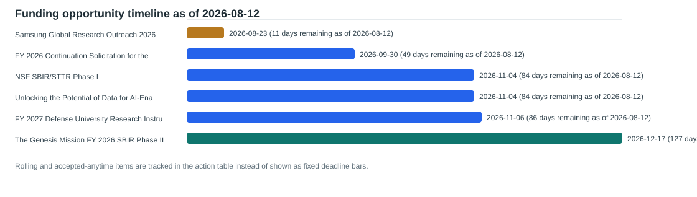

# Current Funding Opportunity Screening

Snapshot date: 2026-08-12
Report refreshed: 2026-08-12

This screening is a curated scan of active or actionable opportunities from the source registry. Sponsor pages remain authoritative, and internal eligibility, cost share, and routing should be verified before action.

## Decision Summary

- Opportunities screened: 11
- Active opportunities: 11
- Passed public deadlines: 0
- Faculty alignments found: 47
- Urgent or overdue action items: 0
- Internal review dates already overdue: 0
- Active dated deadlines within 7 days: 0
- Do not start new-proposal items: 0
- Expedited go/no-go items: 1
- Active opportunities needing sponsor-source recheck: 0
- Source rechecks overdue: 0
- Faculty outreach blocked pending source recheck: 0
- Oldest active source verification age: 0 days
- Rolling or accepted-anytime items tracked separately: 5

## Faculty Action Inbox

| Action status | Sponsor | Program | Public deadline | Proposal runway | Source verification | Internal review by | Match evidence | Next action |
| --- | --- | --- | --- | --- | --- | --- | --- | --- |
| soon | Samsung Electronics | [Samsung Global Research Outreach 2026](https://semiconductor.samsung.com/sait/event/global-research-outreach/) | 2026-08-23; 11 days remaining as of 2026-08-12 | expedited go/no-go; Public deadline is 11 days away; run a fast go/no-go before asking faculty for proposal work. | Last checked 2026-08-12; 0 days old; current enough for triage | 2026-08-14 | Han Hu (promising, score 0.286): heat transfer, thermal management; David Huitink (exploratory, score 0.143): advanced materials; Min Zou (exploratory, score 0.143): advanced materials | Identify one device-level thermal-management concept and obtain a same-week UA agreement and research-development go or no-go decision. |
| planning | U.S. Department of Energy Office of Science | [FY 2026 Continuation Solicitation for the Office of Science Financial Assistance Program](https://science.osti.gov/grants/FOAs/Open) | 2026-09-30; 49 days remaining as of 2026-08-12 | normal planning; Normal planning runway after sponsor source and internal review checks. | Last checked 2026-08-12; 0 days old; current enough for triage | 2026-09-01 | David Huitink (promising, score 0.286): manufacturing, materials; Han Hu (promising, score 0.286): diagnostics, energy systems; Min Zou (promising, score 0.286): manufacturing, materials | Write a one-page concept mapped to a named Office of Science program before requesting a program-officer discussion. |
| planning | National Science Foundation | [NSF SBIR/STTR Phase I](https://www.nsf.gov/funding/opportunities/small-business-innovation-research-small-business-technology) | 2026-11-04; 84 days remaining as of 2026-08-12 | normal planning; Normal planning runway after sponsor source and internal review checks. | Last checked 2026-08-12; 0 days old; current enough for triage | 2026-09-08 | Han Hu (promising, score 0.286): energy systems, thermal management; Darin Nutter (exploratory, score 0.143): energy systems; David Huitink (exploratory, score 0.143): advanced manufacturing | Route only when a specific company has a credible product hypothesis and requests a defined faculty or university role. |
| planning | National Science Foundation | [Unlocking the Potential of Data for AI-Enabled Scientific Discovery](https://www.nsf.gov/funding/opportunities/ai-datasets-unlocking-dataset-value-ai-enabled-scientific-discovery/nsf26-512/solicitation) | 2026-11-04; 84 days remaining as of 2026-08-12 | normal planning; Normal planning runway after sponsor source and internal review checks. | Last checked 2026-08-12; 0 days old; current enough for triage | 2026-09-08 | Han Hu (promising, score 0.250): diagnostics, thermal management; Anthony Gunderman (exploratory, score 0.125): sensing; Neelakshi Majumdar (exploratory, score 0.125): sensing | Inventory an existing NED3 dataset, its rights and metadata gaps, intended user community, and the AI-enabled discovery question before assigning a proposal team. |
| planning | Department of War | [FY 2027 Defense University Research Instrumentation Program](https://www.grants.gov/search-results-detail/363379) | 2026-11-06; 86 days remaining as of 2026-08-12 | normal planning; Normal planning runway after sponsor source and internal review checks. | Last checked 2026-08-12; 0 days old; current enough for triage | 2026-09-10 | Han Hu (promising, score 0.286): flow diagnostics, multiphase flow | Convene prospective users around one non-routine shared instrumentation gap, usage commitments, and a defensible defense-research rationale. |
| watch | U.S. Department of Energy Office of Science | [The Genesis Mission FY 2026 SBIR Phase II](https://science.osti.gov/grants/FOAs/Open) | 2026-12-17; 127 days remaining as of 2026-08-12 | normal planning; Normal planning runway after sponsor source and internal review checks. | Last checked 2026-08-12; 0 days old; current enough for triage | 2026-09-15 | Han Hu (promising, score 0.286): energy systems, thermal management; Darin Nutter (exploratory, score 0.143): energy systems | Keep as a watch item until an eligible Phase I company requests a concrete technical collaboration. |
| accepted anytime | National Science Foundation | [EPSCoR E-RISE and E-CORE Planning Proposals](https://www.nsf.gov/funding/opportunities/dcl-planning-proposals-nsf-established-program-stimulate) | Accepted anytime; no fixed deadline | standing program; No fixed deadline; treat as a standing target after source verification and normal concept review. | Last checked 2026-08-12; 0 days old; current enough for triage | Not set | Darin Nutter (exploratory, score 0.125): energy systems; David Huitink (exploratory, score 0.125): advanced manufacturing; Han Hu (exploratory, score 0.125): energy systems | Define a multi-institution infrastructure need, governance model, workforce plan, and eventual E-RISE or E-CORE logic before drafting. |
| accepted anytime | National Science Foundation | [Fluid Dynamics](https://www.nsf.gov/funding/opportunities/fluid-dynamics) | Accepted anytime; no fixed deadline | standing program; No fixed deadline; treat as a standing target after source verification and normal concept review. | Last checked 2026-08-12; 0 days old; current enough for triage | Not set | Han Hu (promising, score 0.375): flow diagnostics, multiphase flow, thermal fluids; Anthony Gunderman (exploratory, score 0.125): sensing; Neelakshi Majumdar (exploratory, score 0.125): sensing | Route only faculty with a defined fundamental fluid-mechanics hypothesis and experimental or computational validation plan. |
| accepted anytime | National Science Foundation | [Thermal Transport Processes](https://www.nsf.gov/funding/opportunities/ttp-thermal-transport-processes) | Accepted anytime; no fixed deadline | standing program; No fixed deadline; treat as a standing target after source verification and normal concept review. | Last checked 2026-08-12; 0 days old; current enough for triage | Not set | Han Hu (promising, score 0.375): energy systems, heat transfer, thermal management; Wenchao Zhou (promising, score 0.250): materials, modeling; Darin Nutter (exploratory, score 0.125): energy systems | Prepare a two-page fundamental thermal-transport concept that separates the scientific mechanism from its device or system application. |
| accepted anytime | National Science Foundation | [Transport Phenomena](https://www.nsf.gov/funding/opportunities/transport-phenomena) | Accepted anytime; no fixed deadline | standing program; No fixed deadline; treat as a standing target after source verification and normal concept review. | Last checked 2026-08-12; 0 days old; current enough for triage | Not set | Han Hu (strong, score 0.500): energy systems, heat transfer, multiphase flow, thermal management; Wenchao Zhou (promising, score 0.250): manufacturing, modeling; Darin Nutter (exploratory, score 0.125): energy systems | Use for a mature fundamental transport question with a clear mechanism, validation plan, and program-officer discussion target. |
| rolling | National Institute of Standards and Technology | [CHIPS Research and Development Office Broad Agency Announcement](https://www.nist.gov/chips/chips-rd-funding-opportunities/crdo-broad-agency-announcement-baa) | Rolling white papers through Sep 30 2029 unless amended; rolling while open | standing program; No fixed deadline; treat as a standing target after source verification and normal concept review. | Last checked 2026-08-12; 0 days old; current enough for triage | Not set | David Huitink (promising, score 0.375): manufacturing, materials, semiconductors; Min Zou (promising, score 0.250): manufacturing, materials; Wenchao Zhou (promising, score 0.250): manufacturing, materials | Develop a sponsor-facing one-page capability statement only after identifying a semiconductor R&D gap and an appropriate external partner path. |

## Proposal Campaign Board

Campaign fields are local planning judgments. Keyword overlap is screening evidence only; official sponsor records remain authoritative.

| Campaign readiness | MEEG lanes | Opportunity | Eligibility | Scientific fit | Team gap | Next decision |
| --- | --- | --- | --- | --- | --- | --- |
| blocked by partner eligibility | energy-systems, thermal-fluids, diagnostics-ai, advanced-manufacturing | [NSF SBIR/STTR Phase I](https://www.nsf.gov/funding/opportunities/small-business-innovation-research-small-business-technology) | eligible only through qualified small-business lead | manual company-product and faculty-role review required | No qualified company lead, product hypothesis, commercialization plan, or negotiated university role is recorded. | Route only after a company asks for a scoped technical collaboration. |
| blocked by partner eligibility | energy-systems, diagnostics-ai, thermal-fluids | [The Genesis Mission FY 2026 SBIR Phase II](https://science.osti.gov/grants/FOAs/Open) | eligible only through qualified small-business Phase I awardee | manual company-product and defined university-contribution review required | No eligible prior Phase I company or scoped faculty contribution is recorded. | Watch for a qualified company request; do not initiate as a university campaign. |
| needs eligibility confirmation | thermal-fluids, materials, advanced-manufacturing, power-systems | [CHIPS Research and Development Office Broad Agency Announcement](https://www.nist.gov/chips/chips-rd-funding-opportunities/crdo-broad-agency-announcement-baa) | eligibility and invitation-path confirmation required | manual semiconductor R&D gap and partner-role review required | Need a defined semiconductor R&D gap, credible partner or customer signal, and a white-paper-ready capability statement. | Do not draft an investment application; first test a non-confidential white-paper concept against the BAA. |
| needs eligibility confirmation | energy-systems, advanced-manufacturing, diagnostics-ai, data-infrastructure | [EPSCoR E-RISE and E-CORE Planning Proposals](https://www.nsf.gov/funding/opportunities/dcl-planning-proposals-nsf-established-program-stimulate) | EPSCoR jurisdiction and institutional confirmation required | manual infrastructure need, collaboration logic, and workforce impact review required | Need an Arkansas-centered multi-institution capability gap, governance plan, partners, and a credible route to later infrastructure work. | Develop an infrastructure concept before requesting EPSCoR routing; no future competition is implied. |
| needs eligibility confirmation | energy-systems, thermal-fluids, materials, diagnostics-ai | [FY 2026 Continuation Solicitation for the Office of Science Financial Assistance Program](https://science.osti.gov/grants/FOAs/Open) | institutional confirmation required | manual named-program and scientific-centrality review required | Need a named Office of Science program and a scientific question it explicitly supports. | Do not form a proposal team until a program officer or current program text validates the topical home. |
| needs eligibility confirmation | thermal-fluids, diagnostics-ai, materials, power-systems | [FY 2027 Defense University Research Instrumentation Program](https://www.grants.gov/search-results-detail/363379) | institutional confirmation required | shared capability gap and enabled defense-relevant research must be evidenced | Need non-routine shared equipment, committed users, a utilization plan, and defensible defense relevance. | By September 10, compare one equipment capability against existing campus access and document the research it uniquely enables. |
| needs eligibility confirmation | thermal-fluids, diagnostics-ai | [Fluid Dynamics](https://www.nsf.gov/funding/opportunities/fluid-dynamics) | institutional confirmation required | manual fundamental fluid-mechanics contribution review required | Need a central fluid-dynamics hypothesis; generic sensing or computation does not create a campaign. | Seek a program-officer fit check when a focused fluid-mechanics concept is mature. |
| needs eligibility confirmation | thermal-fluids, materials, energy-systems, diagnostics-ai | [Samsung Global Research Outreach 2026](https://semiconductor.samsung.com/sait/event/global-research-outreach/) | institutional agreement confirmation required | strong thermal-management theme signal; select one device-level mechanism and evidence plan | Need one sponsor-aligned research question, an agreement/IP review, and confirmation that no unpublished proprietary detail is needed. | By August 14, decide whether a ready-to-submit non-confidential thermal-management concept exists. |
| needs eligibility confirmation | thermal-fluids, energy-systems, materials, power-systems | [Thermal Transport Processes](https://www.nsf.gov/funding/opportunities/ttp-thermal-transport-processes) | institutional confirmation required | manual fundamental thermal-transport contribution review required | Need a separable mechanism hypothesis, state variables, and validation path beyond a device performance target. | Use this as an evergreen target after a concise mechanism-focused concept is ready. |
| needs eligibility confirmation | thermal-fluids, energy-systems, advanced-manufacturing, materials | [Transport Phenomena](https://www.nsf.gov/funding/opportunities/transport-phenomena) | institutional confirmation required | manual fundamental transport contribution review required | Need a mature mechanism-focused research question rather than an application-only project. | Create a short concept and seek program-officer guidance before committing proposal-development time. |
| needs eligibility confirmation | diagnostics-ai, thermal-fluids, energy-systems, data-infrastructure | [Unlocking the Potential of Data for AI-Enabled Scientific Discovery](https://www.nsf.gov/funding/opportunities/ai-datasets-unlocking-dataset-value-ai-enabled-scientific-discovery/nsf26-512/solicitation) | institutional confirmation required | strong only when an existing NED3 dataset supports a defined AI-enabled discovery use case | Need a verified existing dataset inventory, rights record, metadata plan, target user community, and durable governance owner. | By September 8, choose Planning, Impact, or Flagship only after an evidence-backed dataset readiness review. |

## Deadline Timeline

## Priority View

| Urgency | Sponsor | Program | Deadline | Top aligned faculty/labs | Risk notes |
| --- | --- | --- | --- | --- | --- |
| soon | Samsung Electronics | [Samsung Global Research Outreach 2026](https://semiconductor.samsung.com/sait/event/global-research-outreach/) | 2026-08-23; 11 days remaining as of 2026-08-12 | Han Hu, David Huitink, Min Zou | Eleven-day runway. Do not disclose unpublished invention details or submit until the research agreement and IP implications are reviewed. |
| planning | U.S. Department of Energy Office of Science | [FY 2026 Continuation Solicitation for the Office of Science Financial Assistance Program](https://science.osti.gov/grants/FOAs/Open) | 2026-09-30; 49 days remaining as of 2026-08-12 | David Huitink, Han Hu, Min Zou | The continuation listing is not a topic match by itself; program-level scientific scope controls. |
| planning | National Science Foundation | [NSF SBIR/STTR Phase I](https://www.nsf.gov/funding/opportunities/small-business-innovation-research-small-business-technology) | 2026-11-04; 84 days remaining as of 2026-08-12 | Han Hu, Darin Nutter, David Huitink | Not a university-led route; company ownership, effort, and IP terms require UA review. |
| planning | National Science Foundation | [Unlocking the Potential of Data for AI-Enabled Scientific Discovery](https://www.nsf.gov/funding/opportunities/ai-datasets-unlocking-dataset-value-ai-enabled-scientific-discovery/nsf26-512/solicitation) | 2026-11-04; 84 days remaining as of 2026-08-12 | Han Hu, Anthony Gunderman, Neelakshi Majumdar | A planned dataset is insufficient; the call requires a defensible existing-data asset, governance, and reuse pathway. |
| planning | Department of War | [FY 2027 Defense University Research Instrumentation Program](https://www.grants.gov/search-results-detail/363379) | 2026-11-06; 86 days remaining as of 2026-08-12 | Han Hu | Equipment narrative must establish enabled research and shared demand, not merely list desired purchases. |
| watch | U.S. Department of Energy Office of Science | [The Genesis Mission FY 2026 SBIR Phase II](https://science.osti.gov/grants/FOAs/Open) | 2026-12-17; 127 days remaining as of 2026-08-12 | Han Hu, Darin Nutter | University faculty cannot lead without the required qualified small-business Phase I lineage. |
| accepted anytime | National Science Foundation | [EPSCoR E-RISE and E-CORE Planning Proposals](https://www.nsf.gov/funding/opportunities/dcl-planning-proposals-nsf-established-program-stimulate) | Accepted anytime; no fixed deadline | Darin Nutter, David Huitink, Han Hu | Planning proposals are not a promise of a later competition or an award; state the infrastructure and collaboration need precisely. |
| accepted anytime | National Science Foundation | [Fluid Dynamics](https://www.nsf.gov/funding/opportunities/fluid-dynamics) | Accepted anytime; no fixed deadline | Han Hu, Anthony Gunderman, Neelakshi Majumdar | Generic sensing or CFD use is not enough without a central fluid-dynamics contribution. |
| accepted anytime | National Science Foundation | [Thermal Transport Processes](https://www.nsf.gov/funding/opportunities/ttp-thermal-transport-processes) | Accepted anytime; no fixed deadline | Han Hu, Wenchao Zhou, Darin Nutter | Broad thermal keywords do not establish program fit without a fundamental transport question. |
| accepted anytime | National Science Foundation | [Transport Phenomena](https://www.nsf.gov/funding/opportunities/transport-phenomena) | Accepted anytime; no fixed deadline | Han Hu, Wenchao Zhou, Darin Nutter | An application-driven project needs a central transport-science contribution. |
| rolling | National Institute of Standards and Technology | [CHIPS Research and Development Office Broad Agency Announcement](https://www.nist.gov/chips/chips-rd-funding-opportunities/crdo-broad-agency-announcement-baa) | Rolling white papers through Sep 30 2029 unless amended; rolling while open | David Huitink, Min Zou, Wenchao Zhou | A white paper is required and does not guarantee invitation; do not treat this as an open full-proposal competition. |

## Faculty Briefs

| Faculty | Priority opportunities | Readiness gate | Evidence to verify | Suggested follow-up |
| --- | --- | --- | --- | --- |
| Anthony Gunderman | [Unlocking the Potential of Data for AI-Enabled Scientific Discovery](https://www.nsf.gov/funding/opportunities/ai-datasets-unlocking-dataset-value-ai-enabled-scientific-discovery/nsf26-512/solicitation) (planning; 2026-11-04; 84 days remaining as of 2026-08-12); [Fluid Dynamics](https://www.nsf.gov/funding/opportunities/fluid-dynamics) (accepted anytime; Accepted anytime; no fixed deadline) | Unlocking the Potential of Data for AI-Enabled Scientific Discovery: ready after normal review; Open for routing Runway: normal planning; Normal planning runway after sponsor source and internal review checks.; Fluid Dynamics: ready after normal review; Open for routing Runway: standing program; No fixed deadline; treat as a standing target after source verification and normal concept review. | exploratory fit, score 0.125, terms: sensing; exploratory fit, score 0.125, terms: sensing | Inventory an existing NED3 dataset, its rights and metadata gaps, intended user community, and the AI-enabled discovery question before assigning a proposal team. |
| Darin Nutter | [FY 2026 Continuation Solicitation for the Office of Science Financial Assistance Program](https://science.osti.gov/grants/FOAs/Open) (planning; 2026-09-30; 49 days remaining as of 2026-08-12); [NSF SBIR/STTR Phase I](https://www.nsf.gov/funding/opportunities/small-business-innovation-research-small-business-technology) (planning; 2026-11-04; 84 days remaining as of 2026-08-12); [EPSCoR E-RISE and E-CORE Planning Proposals](https://www.nsf.gov/funding/opportunities/dcl-planning-proposals-nsf-established-program-stimulate) (accepted anytime; Accepted anytime; no fixed deadline); [Thermal Transport Processes](https://www.nsf.gov/funding/opportunities/ttp-thermal-transport-processes) (accepted anytime; Accepted anytime; no fixed deadline) | FY 2026 Continuation Solicitation for the Office of Science Financial Assistance Program: ready after normal review; Open for routing Runway: normal planning; Normal planning runway after sponsor source and internal review checks.; NSF SBIR/STTR Phase I: ready after normal review; Open for routing Runway: normal planning; Normal planning runway after sponsor source and internal review checks.; EPSCoR E-RISE and E-CORE Planning Proposals: ready after normal review; Open for routing Runway: standing program; No fixed deadline; treat as a standing target after source verification and normal concept review.; Thermal Transport Processes: ready after normal review; Open for routing Runway: standing program; No fixed deadline; treat as a standing target after source verification and normal concept review. | exploratory fit, score 0.143, terms: energy systems; exploratory fit, score 0.143, terms: energy systems; exploratory fit, score 0.125, terms: energy systems; exploratory fit, score 0.125, terms: energy systems | Write a one-page concept mapped to a named Office of Science program before requesting a program-officer discussion. |
| David Huitink | [Samsung Global Research Outreach 2026](https://semiconductor.samsung.com/sait/event/global-research-outreach/) (soon; 2026-08-23; 11 days remaining as of 2026-08-12); [FY 2026 Continuation Solicitation for the Office of Science Financial Assistance Program](https://science.osti.gov/grants/FOAs/Open) (planning; 2026-09-30; 49 days remaining as of 2026-08-12); [NSF SBIR/STTR Phase I](https://www.nsf.gov/funding/opportunities/small-business-innovation-research-small-business-technology) (planning; 2026-11-04; 84 days remaining as of 2026-08-12); [EPSCoR E-RISE and E-CORE Planning Proposals](https://www.nsf.gov/funding/opportunities/dcl-planning-proposals-nsf-established-program-stimulate) (accepted anytime; Accepted anytime; no fixed deadline) | Samsung Global Research Outreach 2026: ready after normal review; Open for routing Runway: expedited go/no-go; Public deadline is 11 days away; run a fast go/no-go before asking faculty for proposal work.; FY 2026 Continuation Solicitation for the Office of Science Financial Assistance Program: ready after normal review; Open for routing Runway: normal planning; Normal planning runway after sponsor source and internal review checks.; NSF SBIR/STTR Phase I: ready after normal review; Open for routing Runway: normal planning; Normal planning runway after sponsor source and internal review checks.; EPSCoR E-RISE and E-CORE Planning Proposals: ready after normal review; Open for routing Runway: standing program; No fixed deadline; treat as a standing target after source verification and normal concept review. | exploratory fit, score 0.143, terms: advanced materials; promising fit, score 0.286, terms: manufacturing, materials; exploratory fit, score 0.143, terms: advanced manufacturing; exploratory fit, score 0.125, terms: advanced manufacturing | Identify one device-level thermal-management concept and obtain a same-week UA agreement and research-development go or no-go decision. |
| Han Hu | [Samsung Global Research Outreach 2026](https://semiconductor.samsung.com/sait/event/global-research-outreach/) (soon; 2026-08-23; 11 days remaining as of 2026-08-12); [FY 2026 Continuation Solicitation for the Office of Science Financial Assistance Program](https://science.osti.gov/grants/FOAs/Open) (planning; 2026-09-30; 49 days remaining as of 2026-08-12); [FY 2027 Defense University Research Instrumentation Program](https://www.grants.gov/search-results-detail/363379) (planning; 2026-11-06; 86 days remaining as of 2026-08-12); [NSF SBIR/STTR Phase I](https://www.nsf.gov/funding/opportunities/small-business-innovation-research-small-business-technology) (planning; 2026-11-04; 84 days remaining as of 2026-08-12) | Samsung Global Research Outreach 2026: ready after normal review; Open for routing Runway: expedited go/no-go; Public deadline is 11 days away; run a fast go/no-go before asking faculty for proposal work.; FY 2026 Continuation Solicitation for the Office of Science Financial Assistance Program: ready after normal review; Open for routing Runway: normal planning; Normal planning runway after sponsor source and internal review checks.; FY 2027 Defense University Research Instrumentation Program: ready after normal review; Open for routing Runway: normal planning; Normal planning runway after sponsor source and internal review checks.; NSF SBIR/STTR Phase I: ready after normal review; Open for routing Runway: normal planning; Normal planning runway after sponsor source and internal review checks. | promising fit, score 0.286, terms: heat transfer, thermal management; promising fit, score 0.286, terms: diagnostics, energy systems; promising fit, score 0.286, terms: flow diagnostics, multiphase flow; promising fit, score 0.286, terms: energy systems, thermal management | Identify one device-level thermal-management concept and obtain a same-week UA agreement and research-development go or no-go decision. |
| Min Zou | [Samsung Global Research Outreach 2026](https://semiconductor.samsung.com/sait/event/global-research-outreach/) (soon; 2026-08-23; 11 days remaining as of 2026-08-12); [FY 2026 Continuation Solicitation for the Office of Science Financial Assistance Program](https://science.osti.gov/grants/FOAs/Open) (planning; 2026-09-30; 49 days remaining as of 2026-08-12); [Thermal Transport Processes](https://www.nsf.gov/funding/opportunities/ttp-thermal-transport-processes) (accepted anytime; Accepted anytime; no fixed deadline); [Transport Phenomena](https://www.nsf.gov/funding/opportunities/transport-phenomena) (accepted anytime; Accepted anytime; no fixed deadline) | Samsung Global Research Outreach 2026: ready after normal review; Open for routing Runway: expedited go/no-go; Public deadline is 11 days away; run a fast go/no-go before asking faculty for proposal work.; FY 2026 Continuation Solicitation for the Office of Science Financial Assistance Program: ready after normal review; Open for routing Runway: normal planning; Normal planning runway after sponsor source and internal review checks.; Thermal Transport Processes: ready after normal review; Open for routing Runway: standing program; No fixed deadline; treat as a standing target after source verification and normal concept review.; Transport Phenomena: ready after normal review; Open for routing Runway: standing program; No fixed deadline; treat as a standing target after source verification and normal concept review. | exploratory fit, score 0.143, terms: advanced materials; promising fit, score 0.286, terms: manufacturing, materials; exploratory fit, score 0.125, terms: materials; exploratory fit, score 0.125, terms: manufacturing | Identify one device-level thermal-management concept and obtain a same-week UA agreement and research-development go or no-go decision. |
| Neelakshi Majumdar | [Unlocking the Potential of Data for AI-Enabled Scientific Discovery](https://www.nsf.gov/funding/opportunities/ai-datasets-unlocking-dataset-value-ai-enabled-scientific-discovery/nsf26-512/solicitation) (planning; 2026-11-04; 84 days remaining as of 2026-08-12); [Fluid Dynamics](https://www.nsf.gov/funding/opportunities/fluid-dynamics) (accepted anytime; Accepted anytime; no fixed deadline) | Unlocking the Potential of Data for AI-Enabled Scientific Discovery: ready after normal review; Open for routing Runway: normal planning; Normal planning runway after sponsor source and internal review checks.; Fluid Dynamics: ready after normal review; Open for routing Runway: standing program; No fixed deadline; treat as a standing target after source verification and normal concept review. | exploratory fit, score 0.125, terms: sensing; exploratory fit, score 0.125, terms: sensing | Inventory an existing NED3 dataset, its rights and metadata gaps, intended user community, and the AI-enabled discovery question before assigning a proposal team. |
| Wan Shou | [FY 2026 Continuation Solicitation for the Office of Science Financial Assistance Program](https://science.osti.gov/grants/FOAs/Open) (planning; 2026-09-30; 49 days remaining as of 2026-08-12); [NSF SBIR/STTR Phase I](https://www.nsf.gov/funding/opportunities/small-business-innovation-research-small-business-technology) (planning; 2026-11-04; 84 days remaining as of 2026-08-12); [EPSCoR E-RISE and E-CORE Planning Proposals](https://www.nsf.gov/funding/opportunities/dcl-planning-proposals-nsf-established-program-stimulate) (accepted anytime; Accepted anytime; no fixed deadline); [Transport Phenomena](https://www.nsf.gov/funding/opportunities/transport-phenomena) (accepted anytime; Accepted anytime; no fixed deadline) | FY 2026 Continuation Solicitation for the Office of Science Financial Assistance Program: ready after normal review; Open for routing Runway: normal planning; Normal planning runway after sponsor source and internal review checks.; NSF SBIR/STTR Phase I: ready after normal review; Open for routing Runway: normal planning; Normal planning runway after sponsor source and internal review checks.; EPSCoR E-RISE and E-CORE Planning Proposals: ready after normal review; Open for routing Runway: standing program; No fixed deadline; treat as a standing target after source verification and normal concept review.; Transport Phenomena: ready after normal review; Open for routing Runway: standing program; No fixed deadline; treat as a standing target after source verification and normal concept review. | exploratory fit, score 0.143, terms: manufacturing; exploratory fit, score 0.143, terms: advanced manufacturing; exploratory fit, score 0.125, terms: advanced manufacturing; exploratory fit, score 0.125, terms: manufacturing | Write a one-page concept mapped to a named Office of Science program before requesting a program-officer discussion. |
| Wenchao Zhou | [FY 2026 Continuation Solicitation for the Office of Science Financial Assistance Program](https://science.osti.gov/grants/FOAs/Open) (planning; 2026-09-30; 49 days remaining as of 2026-08-12); [NSF SBIR/STTR Phase I](https://www.nsf.gov/funding/opportunities/small-business-innovation-research-small-business-technology) (planning; 2026-11-04; 84 days remaining as of 2026-08-12); [Thermal Transport Processes](https://www.nsf.gov/funding/opportunities/ttp-thermal-transport-processes) (accepted anytime; Accepted anytime; no fixed deadline); [Transport Phenomena](https://www.nsf.gov/funding/opportunities/transport-phenomena) (accepted anytime; Accepted anytime; no fixed deadline) | FY 2026 Continuation Solicitation for the Office of Science Financial Assistance Program: ready after normal review; Open for routing Runway: normal planning; Normal planning runway after sponsor source and internal review checks.; NSF SBIR/STTR Phase I: ready after normal review; Open for routing Runway: normal planning; Normal planning runway after sponsor source and internal review checks.; Thermal Transport Processes: ready after normal review; Open for routing Runway: standing program; No fixed deadline; treat as a standing target after source verification and normal concept review.; Transport Phenomena: ready after normal review; Open for routing Runway: standing program; No fixed deadline; treat as a standing target after source verification and normal concept review. | promising fit, score 0.286, terms: manufacturing, materials; exploratory fit, score 0.143, terms: advanced manufacturing; promising fit, score 0.250, terms: materials, modeling; promising fit, score 0.250, terms: manufacturing, modeling | Write a one-page concept mapped to a named Office of Science program before requesting a program-officer discussion. |
| Xiangbo Meng | [Samsung Global Research Outreach 2026](https://semiconductor.samsung.com/sait/event/global-research-outreach/) (soon; 2026-08-23; 11 days remaining as of 2026-08-12); [CHIPS Research and Development Office Broad Agency Announcement](https://www.nist.gov/chips/chips-rd-funding-opportunities/crdo-broad-agency-announcement-baa) (rolling; Rolling white papers through Sep 30 2029 unless amended; rolling while open) | Samsung Global Research Outreach 2026: ready after normal review; Open for routing Runway: expedited go/no-go; Public deadline is 11 days away; run a fast go/no-go before asking faculty for proposal work.; CHIPS Research and Development Office Broad Agency Announcement: ready after normal review; Open for routing Runway: standing program; No fixed deadline; treat as a standing target after source verification and normal concept review. | exploratory fit, score 0.143, terms: advanced materials; exploratory fit, score 0.125, terms: semiconductors | Identify one device-level thermal-management concept and obtain a same-week UA agreement and research-development go or no-go decision. |

## Opportunity Notes

### Samsung Global Research Outreach 2026

- Sponsor: Samsung Electronics
- Deadline: 2026-08-23; 11 days remaining as of 2026-08-12
- Deadline type: fixed
- Internal review by: 2026-08-14
- Verified on: 2026-08-12
- Action status: soon
- Next action: Identify one device-level thermal-management concept and obtain a same-week UA agreement and research-development go or no-go decision.
- Risk notes: Eleven-day runway. Do not disclose unpublished invention details or submit until the research agreement and IP implications are reviewed.
- Summary: Samsung seeks university proposals in six research themes including advanced materials and interfaces for device-level thermal management.
- Notes: Public call checked August 12 2026. Proposals must be non-confidential and non-proprietary; university agreement review is a gate.
- Top matches:
  - Han Hu: score 0.286; terms: heat transfer, thermal management
  - David Huitink: score 0.143; terms: advanced materials
  - Min Zou: score 0.143; terms: advanced materials

### FY 2026 Continuation Solicitation for the Office of Science Financial Assistance Program

- Sponsor: U.S. Department of Energy Office of Science
- Deadline: 2026-09-30; 49 days remaining as of 2026-08-12
- Deadline type: fixed
- Internal review by: 2026-09-01
- Verified on: 2026-08-12
- Action status: planning
- Next action: Write a one-page concept mapped to a named Office of Science program before requesting a program-officer discussion.
- Risk notes: The continuation listing is not a topic match by itself; program-level scientific scope controls.
- Summary: Open continuation solicitation for Office of Science financial assistance; a concept must map to a specific SC program and research area.
- Notes: Public FOA listing checked August 12 2026. Pre-applications are optional but encouraged; use only after program-level scope confirmation.
- Top matches:
  - David Huitink: score 0.286; terms: manufacturing, materials
  - Han Hu: score 0.286; terms: diagnostics, energy systems
  - Min Zou: score 0.286; terms: manufacturing, materials

### NSF SBIR/STTR Phase I

- Sponsor: National Science Foundation
- Deadline: 2026-11-04; 84 days remaining as of 2026-08-12
- Deadline type: fixed
- Internal review by: 2026-09-08
- Verified on: 2026-08-12
- Action status: planning
- Next action: Route only when a specific company has a credible product hypothesis and requests a defined faculty or university role.
- Risk notes: Not a university-led route; company ownership, effort, and IP terms require UA review.
- Summary: Supports technology commercialization by qualified small businesses. Relevant for faculty startup collaborations in thermal systems sensing AI software and advanced manufacturing.
- Notes: NSF 26-510 checked August 12 2026. This is not a standard university-led proposal route.
- Top matches:
  - Han Hu: score 0.286; terms: energy systems, thermal management
  - Darin Nutter: score 0.143; terms: energy systems
  - David Huitink: score 0.143; terms: advanced manufacturing

### Unlocking the Potential of Data for AI-Enabled Scientific Discovery

- Sponsor: National Science Foundation
- Deadline: 2026-11-04; 84 days remaining as of 2026-08-12
- Deadline type: fixed
- Internal review by: 2026-09-08
- Verified on: 2026-08-12
- Action status: planning
- Next action: Inventory an existing NED3 dataset, its rights and metadata gaps, intended user community, and the AI-enabled discovery question before assigning a proposal team.
- Risk notes: A planned dataset is insufficient; the call requires a defensible existing-data asset, governance, and reuse pathway.
- Summary: Supports work that increases the value and usability of existing scientific datasets for AI-enabled discovery through data preparation governance and research community engagement.
- Notes: NSF 26-512 checked August 12 2026. Existing datasets and a credible governance and reuse plan are central.
- Top matches:
  - Han Hu: score 0.250; terms: diagnostics, thermal management
  - Anthony Gunderman: score 0.125; terms: sensing
  - Neelakshi Majumdar: score 0.125; terms: sensing

### FY 2027 Defense University Research Instrumentation Program

- Sponsor: Department of War
- Deadline: 2026-11-06; 86 days remaining as of 2026-08-12
- Deadline type: fixed
- Internal review by: 2026-09-10
- Verified on: 2026-08-12
- Action status: planning
- Next action: Convene prospective users around one non-routine shared instrumentation gap, usage commitments, and a defensible defense-research rationale.
- Risk notes: Equipment narrative must establish enabled research and shared demand, not merely list desired purchases.
- Summary: Funds instrumentation that enables defense-relevant research and supports a compelling equipment need rather than routine laboratory replacement.
- Notes: Grants.gov record checked August 12 2026. Start with a shared capability gap and usage commitments before selecting equipment.
- Top matches:
  - Han Hu: score 0.286; terms: flow diagnostics, multiphase flow

### The Genesis Mission FY 2026 SBIR Phase II

- Sponsor: U.S. Department of Energy Office of Science
- Deadline: 2026-12-17; 127 days remaining as of 2026-08-12
- Deadline type: fixed
- Internal review by: 2026-09-15
- Verified on: 2026-08-12
- Action status: watch
- Next action: Keep as a watch item until an eligible Phase I company requests a concrete technical collaboration.
- Risk notes: University faculty cannot lead without the required qualified small-business Phase I lineage.
- Summary: Phase II route for eligible prior Phase I small businesses working on DOE mission-relevant technologies including AI-enabled science and energy applications.
- Notes: Open-FOA list checked August 12 2026. Keep as a partner watch only; do not route as a university-led opportunity.
- Top matches:
  - Han Hu: score 0.286; terms: energy systems, thermal management
  - Darin Nutter: score 0.143; terms: energy systems

### EPSCoR E-RISE and E-CORE Planning Proposals

- Sponsor: National Science Foundation
- Deadline: Accepted anytime; no fixed deadline
- Deadline type: accepted anytime
- Internal review by: Not set
- Verified on: 2026-08-12
- Action status: accepted anytime
- Next action: Define a multi-institution infrastructure need, governance model, workforce plan, and eventual E-RISE or E-CORE logic before drafting.
- Risk notes: Planning proposals are not a promise of a later competition or an award; state the infrastructure and collaboration need precisely.
- Summary: Provides a planning-proposal route to prepare research-infrastructure and multi-institution concepts for future EPSCoR E-RISE or E-CORE opportunities.
- Notes: NSF planning DCL checked August 12 2026. Accepted anytime; date is an internal planning horizon and no future competition is guaranteed.
- Top matches:
  - Darin Nutter: score 0.125; terms: energy systems
  - David Huitink: score 0.125; terms: advanced manufacturing
  - Han Hu: score 0.125; terms: energy systems

### Fluid Dynamics

- Sponsor: National Science Foundation
- Deadline: Accepted anytime; no fixed deadline
- Deadline type: accepted anytime
- Internal review by: Not set
- Verified on: 2026-08-12
- Action status: accepted anytime
- Next action: Route only faculty with a defined fundamental fluid-mechanics hypothesis and experimental or computational validation plan.
- Risk notes: Generic sensing or CFD use is not enough without a central fluid-dynamics contribution.
- Summary: Supports fundamental fluid dynamics research including flows relevant to energy manufacturing and engineered systems.
- Notes: Program page checked August 12 2026. Full proposals are accepted anytime; date is an internal planning horizon not a sponsor deadline.
- Top matches:
  - Han Hu: score 0.375; terms: flow diagnostics, multiphase flow, thermal fluids
  - Anthony Gunderman: score 0.125; terms: sensing
  - Neelakshi Majumdar: score 0.125; terms: sensing

### Thermal Transport Processes

- Sponsor: National Science Foundation
- Deadline: Accepted anytime; no fixed deadline
- Deadline type: accepted anytime
- Internal review by: Not set
- Verified on: 2026-08-12
- Action status: accepted anytime
- Next action: Prepare a two-page fundamental thermal-transport concept that separates the scientific mechanism from its device or system application.
- Risk notes: Broad thermal keywords do not establish program fit without a fundamental transport question.
- Summary: Supports fundamental research on thermal transport phenomena and processes across length and time scales.
- Notes: Program page checked August 12 2026. Full proposals are accepted anytime; date is an internal planning horizon not a sponsor deadline.
- Top matches:
  - Han Hu: score 0.375; terms: energy systems, heat transfer, thermal management
  - Wenchao Zhou: score 0.250; terms: materials, modeling
  - Darin Nutter: score 0.125; terms: energy systems

### Transport Phenomena

- Sponsor: National Science Foundation
- Deadline: Accepted anytime; no fixed deadline
- Deadline type: accepted anytime
- Internal review by: Not set
- Verified on: 2026-08-12
- Action status: accepted anytime
- Next action: Use for a mature fundamental transport question with a clear mechanism, validation plan, and program-officer discussion target.
- Risk notes: An application-driven project needs a central transport-science contribution.
- Summary: Supports fundamental transport research across scales including heat mass and momentum transfer with connections to manufacturing microelectronics and emerging applications.
- Notes: Program page checked August 12 2026. Full proposals are accepted anytime; date is an internal planning horizon not a sponsor deadline.
- Top matches:
  - Han Hu: score 0.500; terms: energy systems, heat transfer, multiphase flow, thermal management
  - Wenchao Zhou: score 0.250; terms: manufacturing, modeling
  - Darin Nutter: score 0.125; terms: energy systems

### CHIPS Research and Development Office Broad Agency Announcement

- Sponsor: National Institute of Standards and Technology
- Deadline: Rolling white papers through Sep 30 2029 unless amended; rolling while open
- Deadline type: rolling
- Internal review by: Not set
- Verified on: 2026-08-12
- Action status: rolling
- Next action: Develop a sponsor-facing one-page capability statement only after identifying a semiconductor R&D gap and an appropriate external partner path.
- Risk notes: A white paper is required and does not guarantee invitation; do not treat this as an open full-proposal competition.
- Summary: CHIPS CRDO invites white papers for semiconductor R&D including advanced packaging manufacturing and related technology gaps; selected concepts may be invited to advance.
- Notes: BAA and FAQ checked August 12 2026. White paper is required; a full investment application is invitation-only.
- Top matches:
  - David Huitink: score 0.375; terms: manufacturing, materials, semiconductors
  - Min Zou: score 0.250; terms: manufacturing, materials
  - Wenchao Zhou: score 0.250; terms: manufacturing, materials
