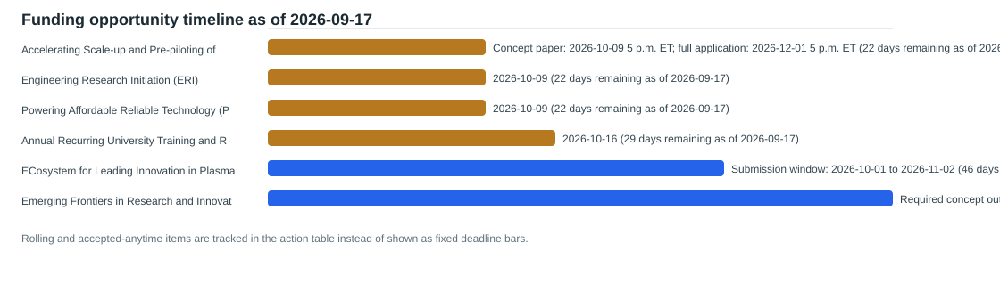

# Current Funding Opportunity Screening

Snapshot date: 2026-09-17
Report refreshed: 2026-09-17

This screening is a curated scan of active or actionable opportunities from the source registry. Sponsor pages remain authoritative, and internal eligibility, cost share, and routing should be verified before action.

## Decision Summary

- Opportunities screened: 8
- Active opportunities: 8
- Passed public deadlines: 0
- Faculty alignments found: 40
- Urgent or overdue action items: 0
- Internal review dates already overdue: 0
- Active dated deadlines within 7 days: 0
- Do not start new-proposal items: 0
- Expedited go/no-go items: 0
- Active opportunities needing sponsor-source recheck: 0
- Source rechecks overdue: 0
- Faculty outreach blocked pending source recheck: 0
- Oldest active source verification age: 0 days
- Rolling or accepted-anytime items tracked separately: 2

## Faculty Action Inbox

| Action status | Sponsor | Program | Public deadline | Proposal runway | Source verification | Internal review by | Match evidence | Next action |
| --- | --- | --- | --- | --- | --- | --- | --- | --- |
| soon | U.S. Department of Energy | [Accelerating Scale-up and Pre-piloting of Emerging Chemical Technologies (ASPECT)](https://eere-exchange.energy.gov/Default.aspx?Search=notice+of+intent) | Concept paper: 2026-10-09 5 p.m. ET; full application: 2026-12-01 5 p.m. ET; 22 days remaining as of 2026-09-17 | normal planning; Normal planning runway after sponsor source and internal review checks. | Last checked 2026-09-17; 0 days old; current enough for triage | 2026-09-23 | Darin Nutter (promising, score 0.250): energy efficiency, technoeconomic analysis; David Huitink (promising, score 0.250): manufacturing, process technology; Wan Shou (promising, score 0.250): manufacturing, process technology | Run a rapid go/no-go with energy-process, manufacturing, and industry-partnership leads before the concept-paper deadline. |
| soon | National Science Foundation | [Engineering Research Initiation (ERI)](https://www.nsf.gov/funding/opportunities/eri-engineering-research-initiation) | 2026-10-09; 22 days remaining as of 2026-09-17 | normal planning; Normal planning runway after sponsor source and internal review checks. | Last checked 2026-09-17; 0 days old; current enough for triage | Not set | Manual review | Archive for UArk faculty routing because the program excludes investigators affiliated with very-high-research-activity R1 institutions. |
| soon | U.S. Department of Agriculture Rural Utilities Service | [Powering Affordable Reliable Technology (PART) Energy Program](https://simpler.grants.gov/opportunity/354883d0-cdf7-4353-90d4-59d5b8f7c331) | 2026-10-09; 22 days remaining as of 2026-09-17 | normal planning; Normal planning runway after sponsor source and internal review checks. | Last checked 2026-09-17; 0 days old; current enough for triage | 2026-09-23 | Darin Nutter (promising, score 0.250): energy systems, technoeconomic analysis; Han Hu (exploratory, score 0.125): energy systems | Do not initiate as a university-led proposal; only explore if an eligible rural-utility partner requests technical collaboration. |
| soon | U.S. Department of Energy National Energy Technology Laboratory | [Annual Recurring University Training and Research](https://simpler.grants.gov/opportunity/d5000ab5-7171-4c60-8d85-ce2117bfc9aa) | 2026-10-16; 29 days remaining as of 2026-09-17 | normal planning; Normal planning runway after sponsor source and internal review checks. | Last checked 2026-09-17; 0 days old; current enough for triage | 2026-09-25 | David Huitink (promising, score 0.333): manufacturing, materials, thermal systems; Min Zou (exploratory, score 0.222): manufacturing, materials; Wenchao Zhou (exploratory, score 0.222): manufacturing, materials | Identify whether an energy-systems training concept with a faculty team is viable before committing proposal-development time. |
| planning | National Science Foundation | [ECosystem for Leading Innovation in Plasma Science and Engineering (ECLIPSE)](https://www.nsf.gov/funding/opportunities/eclipse-ecosystem-leading-innovation-plasma-science-engineering) | Submission window: 2026-10-01 to 2026-11-02; 46 days remaining as of 2026-09-17 | normal planning; Normal planning runway after sponsor source and internal review checks. | Last checked 2026-09-17; 0 days old; current enough for triage | 2026-10-01 | David Huitink (promising, score 0.286): manufacturing, materials; Min Zou (promising, score 0.286): manufacturing, materials; Wenchao Zhou (promising, score 0.286): manufacturing, materials | Seek a short technical relevance check from materials and high-temperature-systems faculty before campaign formation. |
| planning | National Science Foundation | [Emerging Frontiers in Research and Innovation (EFRI): Wave-Based Computing](https://www.nsf.gov/funding/opportunities/efri-wbc-emerging-frontiers-research-innovation-efri-wave-based) | Required concept outline: 2026-11-19; invited full proposal: 2027-02-11; 63 days remaining as of 2026-09-17 | normal planning; Normal planning runway after sponsor source and internal review checks. | Last checked 2026-09-17; 0 days old; current enough for triage | 2026-10-15 | David Huitink (exploratory, score 0.200): manufacturing, materials; Han Hu (exploratory, score 0.200): ai, machine learning; Min Zou (exploratory, score 0.200): manufacturing, materials | Run a concept-fit discussion around wave physics, materials, transducers, sensing, and computing before soliciting collaborators. |
| accepted anytime | National Science Foundation | [Engineering (ENG): Chemical Bioengineering Energy and Transport Systems (CBET)](https://www.nsf.gov/funding/opportunities/engineering-eng-chemical-bioengineering-energy-transport/nsf26-518/solicitation) | Accepted anytime; no fixed deadline | standing program; No fixed deadline; treat as a standing target after source verification and normal concept review. | Last checked 2026-09-17; 0 days old; current enough for triage | Not set | Han Hu (promising, score 0.444): energy systems, heat transfer, multiphase flow, thermal fluids; Darin Nutter (exploratory, score 0.222): energy efficiency, energy systems; David Huitink (exploratory, score 0.111): materials | Develop thermal-fluid, energy, or transport concept summaries and contact the relevant program officer before drafting. |
| accepted anytime | National Science Foundation | [Engineering (ENG): Civil Mechanical and Manufacturing Innovation (CMMI)](https://www.nsf.gov/funding/opportunities/engineering-eng-civil-mechanical-manufacturing-innovation/nsf26-515/solicitation) | Accepted anytime; no fixed deadline | standing program; No fixed deadline; treat as a standing target after source verification and normal concept review. | Last checked 2026-09-17; 0 days old; current enough for triage | Not set | David Huitink (promising, score 0.375): advanced manufacturing, manufacturing, materials; Wenchao Zhou (promising, score 0.375): advanced manufacturing, manufacturing, materials; Anthony Gunderman (promising, score 0.250): robotics, systems engineering | Develop a one-page concept and request program-officer guidance for a 2027 submission target. |

## Proposal Campaign Board

Campaign fields are local planning judgments. Keyword overlap is screening evidence only; official sponsor records remain authoritative.

| Campaign readiness | MEEG lanes | Opportunity | Eligibility | Scientific fit | Team gap | Next decision |
| --- | --- | --- | --- | --- | --- | --- |
| blocked by partner eligibility | Not classified | [Engineering Research Initiation (ERI)](https://www.nsf.gov/funding/opportunities/eri-engineering-research-initiation) | eligible only for investigators not affiliated with very-high-research-activity R1 institutions | not routed for UArk faculty despite broad engineering relevance | University of Arkansas R1 affiliation is disqualifying for the screened faculty cohort. | Archive for UArk faculty routing. |
| blocked by partner eligibility | energy systems | [Powering Affordable Reliable Technology (PART) Energy Program](https://simpler.grants.gov/opportunity/354883d0-cdf7-4353-90d4-59d5b8f7c331) | eligible only through a qualified rural-utility or project applicant partner | technical support may fit energy systems and technoeconomic analysis, but only if a project partner defines the need | Requires an eligible borrower and a defined project; no university-led campaign. | Route only in response to a qualified partner request. |
| needs eligibility confirmation | energy systems, advanced manufacturing, materials | [Accelerating Scale-up and Pre-piloting of Emerging Chemical Technologies (ASPECT)](https://eere-exchange.energy.gov/Default.aspx?Search=notice+of+intent) | confirmation required: verify applicant, cost-share, and teaming rules | possible fit for energy-process scale-up, manufacturing, and technoeconomic research; confirm Topic Area 2 relevance | Likely needs an industry or demonstration partner and a process-technology lead. | By September 23, decide whether a verified team can support a concept paper. |
| needs eligibility confirmation | energy systems, advanced manufacturing, materials | [Annual Recurring University Training and Research](https://simpler.grants.gov/opportunity/d5000ab5-7171-4c60-8d85-ce2117bfc9aa) | confirmation required: verify institutional submission and technical-topic requirements | possible fit for cross-cutting energy, materials, manufacturing, and workforce-development themes | Needs a coherent energy research theme, student-training plan, and sponsor-topic confirmation. | By September 25, decide whether to form a small faculty concept team. |
| needs eligibility confirmation | materials, advanced manufacturing, energy systems | [ECosystem for Leading Innovation in Plasma Science and Engineering (ECLIPSE)](https://www.nsf.gov/funding/opportunities/eclipse-ecosystem-leading-innovation-plasma-science-engineering) | confirmation required: verify participating program-area routing | requires a demonstrated plasma-science or enabling-materials contribution | Needs a plasma-science lead and a defined MEEG role beyond keyword similarity. | Conduct a scientific-role screen before any faculty outreach. |
| needs eligibility confirmation | materials, sensing and diagnostics, energy systems | [Emerging Frontiers in Research and Innovation (EFRI): Wave-Based Computing](https://www.nsf.gov/funding/opportunities/efri-wbc-emerging-frontiers-research-innovation-efri-wave-based) | confirmation required: concept outline, invitation, and one-proposal-per-PI-or-co-PI limits | requires a central physical wave-computing contribution, not generic AI or materials activity | Needs wave-physics, device, and computation partners with an integrated research question. | Before October 15, decide whether a credible concept-outline team exists. |
| ready for faculty decision | thermal fluids, energy systems, materials | [Engineering (ENG): Chemical Bioengineering Energy and Transport Systems (CBET)](https://www.nsf.gov/funding/opportunities/engineering-eng-chemical-bioengineering-energy-transport/nsf26-518/solicitation) | normal institutional eligibility; confirm the selected core program | strong standing route for thermal-fluid, energy, transport, water, and material-resource research when a specific program fit is established | Needs a specific CBET program home and sponsor-relevance confirmation. | Develop a focused concept brief and request program-officer fit guidance. |
| ready for faculty decision | advanced manufacturing, materials, robotics and autonomy, systems engineering | [Engineering (ENG): Civil Mechanical and Manufacturing Innovation (CMMI)](https://www.nsf.gov/funding/opportunities/engineering-eng-civil-mechanical-manufacturing-innovation/nsf26-515/solicitation) | normal institutional eligibility; confirm the selected core program | strong standing route for mechanical, manufacturing, materials, robotics, and systems research when a specific program fit is established | Needs a specific core-program home and an intellectually coherent research question. | Create a program-officer-ready concept summary for the best-supported faculty idea. |

## Deadline Timeline

## Priority View

| Urgency | Sponsor | Program | Deadline | Top aligned faculty/labs | Risk notes |
| --- | --- | --- | --- | --- | --- |
| soon | U.S. Department of Energy | [Accelerating Scale-up and Pre-piloting of Emerging Chemical Technologies (ASPECT)](https://eere-exchange.energy.gov/Default.aspx?Search=notice+of+intent) | Concept paper: 2026-10-09 5 p.m. ET; full application: 2026-12-01 5 p.m. ET; 22 days remaining as of 2026-09-17 | Darin Nutter, David Huitink, Wan Shou | Near-term concept-paper deadline; scale-up and pre-pilot readiness may require partners, cost share, and evidence beyond a single academic lab. |
| soon | National Science Foundation | [Engineering Research Initiation (ERI)](https://www.nsf.gov/funding/opportunities/eri-engineering-research-initiation) | 2026-10-09; 22 days remaining as of 2026-09-17 | Manual review | Screened out for University of Arkansas R1 affiliation; do not recommend as an active UArk faculty opportunity. |
| soon | U.S. Department of Agriculture Rural Utilities Service | [Powering Affordable Reliable Technology (PART) Energy Program](https://simpler.grants.gov/opportunity/354883d0-cdf7-4353-90d4-59d5b8f7c331) | 2026-10-09; 22 days remaining as of 2026-09-17 | Darin Nutter, Han Hu | Partner-facing loan program, not a conventional university research grant. |
| soon | U.S. Department of Energy National Energy Technology Laboratory | [Annual Recurring University Training and Research](https://simpler.grants.gov/opportunity/d5000ab5-7171-4c60-8d85-ce2117bfc9aa) | 2026-10-16; 29 days remaining as of 2026-09-17 | David Huitink, Min Zou, Wenchao Zhou | Opportunity is broad; scientific topic fit, cohort design, and sponsor priorities need direct review. |
| planning | National Science Foundation | [ECosystem for Leading Innovation in Plasma Science and Engineering (ECLIPSE)](https://www.nsf.gov/funding/opportunities/eclipse-ecosystem-leading-innovation-plasma-science-engineering) | Submission window: 2026-10-01 to 2026-11-02; 46 days remaining as of 2026-09-17 | David Huitink, Min Zou, Wenchao Zhou | Keyword overlap does not establish a plasma-science role; route only with a credible enabling-materials or systems contribution. |
| planning | National Science Foundation | [Emerging Frontiers in Research and Innovation (EFRI): Wave-Based Computing](https://www.nsf.gov/funding/opportunities/efri-wbc-emerging-frontiers-research-innovation-efri-wave-based) | Required concept outline: 2026-11-19; invited full proposal: 2027-02-11; 63 days remaining as of 2026-09-17 | David Huitink, Han Hu, Min Zou | Concept outline plus NSF invitation are mandatory; ordinary AI or generic materials work alone is not sufficient. |
| accepted anytime | National Science Foundation | [Engineering (ENG): Chemical Bioengineering Energy and Transport Systems (CBET)](https://www.nsf.gov/funding/opportunities/engineering-eng-chemical-bioengineering-energy-transport/nsf26-518/solicitation) | Accepted anytime; no fixed deadline | Han Hu, Darin Nutter, David Huitink | Standing program; keyword fit must be followed by a specific program and intellectual-merit fit check. |
| accepted anytime | National Science Foundation | [Engineering (ENG): Civil Mechanical and Manufacturing Innovation (CMMI)](https://www.nsf.gov/funding/opportunities/engineering-eng-civil-mechanical-manufacturing-innovation/nsf26-515/solicitation) | Accepted anytime; no fixed deadline | David Huitink, Wenchao Zhou, Anthony Gunderman | Standing program; screen and plan by scientific readiness rather than an artificial calendar date. |

## Faculty Briefs

| Faculty | Priority opportunities | Readiness gate | Evidence to verify | Suggested follow-up |
| --- | --- | --- | --- | --- |
| Anthony Gunderman | [Emerging Frontiers in Research and Innovation (EFRI): Wave-Based Computing](https://www.nsf.gov/funding/opportunities/efri-wbc-emerging-frontiers-research-innovation-efri-wave-based) (planning; Required concept outline: 2026-11-19; invited full proposal: 2027-02-11; 63 days remaining as of 2026-09-17); [Engineering (ENG): Civil Mechanical and Manufacturing Innovation (CMMI)](https://www.nsf.gov/funding/opportunities/engineering-eng-civil-mechanical-manufacturing-innovation/nsf26-515/solicitation) (accepted anytime; Accepted anytime; no fixed deadline) | Emerging Frontiers in Research and Innovation (EFRI): Wave-Based Computing: ready after normal review; Open for routing Runway: normal planning; Normal planning runway after sponsor source and internal review checks.; Engineering (ENG): Civil Mechanical and Manufacturing Innovation (CMMI): ready after normal review; Open for routing Runway: standing program; No fixed deadline; treat as a standing target after source verification and normal concept review. | exploratory fit, score 0.100, terms: sensing; promising fit, score 0.250, terms: robotics, systems engineering | Run a concept-fit discussion around wave physics, materials, transducers, sensing, and computing before soliciting collaborators. |
| Darin Nutter | [Accelerating Scale-up and Pre-piloting of Emerging Chemical Technologies (ASPECT)](https://eere-exchange.energy.gov/Default.aspx?Search=notice+of+intent) (soon; Concept paper: 2026-10-09 5 p.m. ET; full application: 2026-12-01 5 p.m. ET; 22 days remaining as of 2026-09-17); [Powering Affordable Reliable Technology (PART) Energy Program](https://simpler.grants.gov/opportunity/354883d0-cdf7-4353-90d4-59d5b8f7c331) (soon; 2026-10-09; 22 days remaining as of 2026-09-17); [Emerging Frontiers in Research and Innovation (EFRI): Wave-Based Computing](https://www.nsf.gov/funding/opportunities/efri-wbc-emerging-frontiers-research-innovation-efri-wave-based) (planning; Required concept outline: 2026-11-19; invited full proposal: 2027-02-11; 63 days remaining as of 2026-09-17); [Engineering (ENG): Chemical Bioengineering Energy and Transport Systems (CBET)](https://www.nsf.gov/funding/opportunities/engineering-eng-chemical-bioengineering-energy-transport/nsf26-518/solicitation) (accepted anytime; Accepted anytime; no fixed deadline) | Accelerating Scale-up and Pre-piloting of Emerging Chemical Technologies (ASPECT): ready after normal review; Open for routing Runway: normal planning; Normal planning runway after sponsor source and internal review checks.; Powering Affordable Reliable Technology (PART) Energy Program: ready after normal review; Open for routing Runway: normal planning; Normal planning runway after sponsor source and internal review checks.; Emerging Frontiers in Research and Innovation (EFRI): Wave-Based Computing: ready after normal review; Open for routing Runway: normal planning; Normal planning runway after sponsor source and internal review checks.; Engineering (ENG): Chemical Bioengineering Energy and Transport Systems (CBET): ready after normal review; Open for routing Runway: standing program; No fixed deadline; treat as a standing target after source verification and normal concept review. | promising fit, score 0.250, terms: energy efficiency, technoeconomic analysis; promising fit, score 0.250, terms: energy systems, technoeconomic analysis; exploratory fit, score 0.100, terms: energy efficiency; exploratory fit, score 0.222, terms: energy efficiency, energy systems | Run a rapid go/no-go with energy-process, manufacturing, and industry-partnership leads before the concept-paper deadline. |
| David Huitink | [Annual Recurring University Training and Research](https://simpler.grants.gov/opportunity/d5000ab5-7171-4c60-8d85-ce2117bfc9aa) (soon; 2026-10-16; 29 days remaining as of 2026-09-17); [Accelerating Scale-up and Pre-piloting of Emerging Chemical Technologies (ASPECT)](https://eere-exchange.energy.gov/Default.aspx?Search=notice+of+intent) (soon; Concept paper: 2026-10-09 5 p.m. ET; full application: 2026-12-01 5 p.m. ET; 22 days remaining as of 2026-09-17); [ECosystem for Leading Innovation in Plasma Science and Engineering (ECLIPSE)](https://www.nsf.gov/funding/opportunities/eclipse-ecosystem-leading-innovation-plasma-science-engineering) (planning; Submission window: 2026-10-01 to 2026-11-02; 46 days remaining as of 2026-09-17); [Emerging Frontiers in Research and Innovation (EFRI): Wave-Based Computing](https://www.nsf.gov/funding/opportunities/efri-wbc-emerging-frontiers-research-innovation-efri-wave-based) (planning; Required concept outline: 2026-11-19; invited full proposal: 2027-02-11; 63 days remaining as of 2026-09-17) | Annual Recurring University Training and Research: ready after normal review; Open for routing Runway: normal planning; Normal planning runway after sponsor source and internal review checks.; Accelerating Scale-up and Pre-piloting of Emerging Chemical Technologies (ASPECT): ready after normal review; Open for routing Runway: normal planning; Normal planning runway after sponsor source and internal review checks.; ECosystem for Leading Innovation in Plasma Science and Engineering (ECLIPSE): ready after normal review; Open for routing Runway: normal planning; Normal planning runway after sponsor source and internal review checks.; Emerging Frontiers in Research and Innovation (EFRI): Wave-Based Computing: ready after normal review; Open for routing Runway: normal planning; Normal planning runway after sponsor source and internal review checks. | promising fit, score 0.333, terms: manufacturing, materials, thermal systems; promising fit, score 0.250, terms: manufacturing, process technology; promising fit, score 0.286, terms: manufacturing, materials; exploratory fit, score 0.200, terms: manufacturing, materials | Identify whether an energy-systems training concept with a faculty team is viable before committing proposal-development time. |
| David Jensen | [Emerging Frontiers in Research and Innovation (EFRI): Wave-Based Computing](https://www.nsf.gov/funding/opportunities/efri-wbc-emerging-frontiers-research-innovation-efri-wave-based) (planning; Required concept outline: 2026-11-19; invited full proposal: 2027-02-11; 63 days remaining as of 2026-09-17); [Engineering (ENG): Civil Mechanical and Manufacturing Innovation (CMMI)](https://www.nsf.gov/funding/opportunities/engineering-eng-civil-mechanical-manufacturing-innovation/nsf26-515/solicitation) (accepted anytime; Accepted anytime; no fixed deadline) | Emerging Frontiers in Research and Innovation (EFRI): Wave-Based Computing: ready after normal review; Open for routing Runway: normal planning; Normal planning runway after sponsor source and internal review checks.; Engineering (ENG): Civil Mechanical and Manufacturing Innovation (CMMI): ready after normal review; Open for routing Runway: standing program; No fixed deadline; treat as a standing target after source verification and normal concept review. | exploratory fit, score 0.100, terms: ai; promising fit, score 0.250, terms: engineering design, systems engineering | Run a concept-fit discussion around wave physics, materials, transducers, sensing, and computing before soliciting collaborators. |
| Han Hu | [Powering Affordable Reliable Technology (PART) Energy Program](https://simpler.grants.gov/opportunity/354883d0-cdf7-4353-90d4-59d5b8f7c331) (soon; 2026-10-09; 22 days remaining as of 2026-09-17); [Annual Recurring University Training and Research](https://simpler.grants.gov/opportunity/d5000ab5-7171-4c60-8d85-ce2117bfc9aa) (soon; 2026-10-16; 29 days remaining as of 2026-09-17); [Emerging Frontiers in Research and Innovation (EFRI): Wave-Based Computing](https://www.nsf.gov/funding/opportunities/efri-wbc-emerging-frontiers-research-innovation-efri-wave-based) (planning; Required concept outline: 2026-11-19; invited full proposal: 2027-02-11; 63 days remaining as of 2026-09-17); [Engineering (ENG): Chemical Bioengineering Energy and Transport Systems (CBET)](https://www.nsf.gov/funding/opportunities/engineering-eng-chemical-bioengineering-energy-transport/nsf26-518/solicitation) (accepted anytime; Accepted anytime; no fixed deadline) | Powering Affordable Reliable Technology (PART) Energy Program: ready after normal review; Open for routing Runway: normal planning; Normal planning runway after sponsor source and internal review checks.; Annual Recurring University Training and Research: ready after normal review; Open for routing Runway: normal planning; Normal planning runway after sponsor source and internal review checks.; Emerging Frontiers in Research and Innovation (EFRI): Wave-Based Computing: ready after normal review; Open for routing Runway: normal planning; Normal planning runway after sponsor source and internal review checks.; Engineering (ENG): Chemical Bioengineering Energy and Transport Systems (CBET): ready after normal review; Open for routing Runway: standing program; No fixed deadline; treat as a standing target after source verification and normal concept review. | exploratory fit, score 0.125, terms: energy systems; exploratory fit, score 0.111, terms: instrumentation; exploratory fit, score 0.200, terms: ai, machine learning; promising fit, score 0.444, terms: energy systems, heat transfer, multiphase flow, thermal fluids | Do not initiate as a university-led proposal; only explore if an eligible rural-utility partner requests technical collaboration. |
| Min Zou | [Annual Recurring University Training and Research](https://simpler.grants.gov/opportunity/d5000ab5-7171-4c60-8d85-ce2117bfc9aa) (soon; 2026-10-16; 29 days remaining as of 2026-09-17); [Accelerating Scale-up and Pre-piloting of Emerging Chemical Technologies (ASPECT)](https://eere-exchange.energy.gov/Default.aspx?Search=notice+of+intent) (soon; Concept paper: 2026-10-09 5 p.m. ET; full application: 2026-12-01 5 p.m. ET; 22 days remaining as of 2026-09-17); [ECosystem for Leading Innovation in Plasma Science and Engineering (ECLIPSE)](https://www.nsf.gov/funding/opportunities/eclipse-ecosystem-leading-innovation-plasma-science-engineering) (planning; Submission window: 2026-10-01 to 2026-11-02; 46 days remaining as of 2026-09-17); [Emerging Frontiers in Research and Innovation (EFRI): Wave-Based Computing](https://www.nsf.gov/funding/opportunities/efri-wbc-emerging-frontiers-research-innovation-efri-wave-based) (planning; Required concept outline: 2026-11-19; invited full proposal: 2027-02-11; 63 days remaining as of 2026-09-17) | Annual Recurring University Training and Research: ready after normal review; Open for routing Runway: normal planning; Normal planning runway after sponsor source and internal review checks.; Accelerating Scale-up and Pre-piloting of Emerging Chemical Technologies (ASPECT): ready after normal review; Open for routing Runway: normal planning; Normal planning runway after sponsor source and internal review checks.; ECosystem for Leading Innovation in Plasma Science and Engineering (ECLIPSE): ready after normal review; Open for routing Runway: normal planning; Normal planning runway after sponsor source and internal review checks.; Emerging Frontiers in Research and Innovation (EFRI): Wave-Based Computing: ready after normal review; Open for routing Runway: normal planning; Normal planning runway after sponsor source and internal review checks. | exploratory fit, score 0.222, terms: manufacturing, materials; exploratory fit, score 0.125, terms: manufacturing; promising fit, score 0.286, terms: manufacturing, materials; exploratory fit, score 0.200, terms: manufacturing, materials | Identify whether an energy-systems training concept with a faculty team is viable before committing proposal-development time. |
| Neelakshi Majumdar | [Emerging Frontiers in Research and Innovation (EFRI): Wave-Based Computing](https://www.nsf.gov/funding/opportunities/efri-wbc-emerging-frontiers-research-innovation-efri-wave-based) (planning; Required concept outline: 2026-11-19; invited full proposal: 2027-02-11; 63 days remaining as of 2026-09-17); [Engineering (ENG): Civil Mechanical and Manufacturing Innovation (CMMI)](https://www.nsf.gov/funding/opportunities/engineering-eng-civil-mechanical-manufacturing-innovation/nsf26-515/solicitation) (accepted anytime; Accepted anytime; no fixed deadline) | Emerging Frontiers in Research and Innovation (EFRI): Wave-Based Computing: ready after normal review; Open for routing Runway: normal planning; Normal planning runway after sponsor source and internal review checks.; Engineering (ENG): Civil Mechanical and Manufacturing Innovation (CMMI): ready after normal review; Open for routing Runway: standing program; No fixed deadline; treat as a standing target after source verification and normal concept review. | exploratory fit, score 0.100, terms: sensing; exploratory fit, score 0.125, terms: systems engineering | Run a concept-fit discussion around wave physics, materials, transducers, sensing, and computing before soliciting collaborators. |
| Wan Shou | [Accelerating Scale-up and Pre-piloting of Emerging Chemical Technologies (ASPECT)](https://eere-exchange.energy.gov/Default.aspx?Search=notice+of+intent) (soon; Concept paper: 2026-10-09 5 p.m. ET; full application: 2026-12-01 5 p.m. ET; 22 days remaining as of 2026-09-17); [Annual Recurring University Training and Research](https://simpler.grants.gov/opportunity/d5000ab5-7171-4c60-8d85-ce2117bfc9aa) (soon; 2026-10-16; 29 days remaining as of 2026-09-17); [ECosystem for Leading Innovation in Plasma Science and Engineering (ECLIPSE)](https://www.nsf.gov/funding/opportunities/eclipse-ecosystem-leading-innovation-plasma-science-engineering) (planning; Submission window: 2026-10-01 to 2026-11-02; 46 days remaining as of 2026-09-17); [Emerging Frontiers in Research and Innovation (EFRI): Wave-Based Computing](https://www.nsf.gov/funding/opportunities/efri-wbc-emerging-frontiers-research-innovation-efri-wave-based) (planning; Required concept outline: 2026-11-19; invited full proposal: 2027-02-11; 63 days remaining as of 2026-09-17) | Accelerating Scale-up and Pre-piloting of Emerging Chemical Technologies (ASPECT): ready after normal review; Open for routing Runway: normal planning; Normal planning runway after sponsor source and internal review checks.; Annual Recurring University Training and Research: ready after normal review; Open for routing Runway: normal planning; Normal planning runway after sponsor source and internal review checks.; ECosystem for Leading Innovation in Plasma Science and Engineering (ECLIPSE): ready after normal review; Open for routing Runway: normal planning; Normal planning runway after sponsor source and internal review checks.; Emerging Frontiers in Research and Innovation (EFRI): Wave-Based Computing: ready after normal review; Open for routing Runway: normal planning; Normal planning runway after sponsor source and internal review checks. | promising fit, score 0.250, terms: manufacturing, process technology; exploratory fit, score 0.111, terms: manufacturing; exploratory fit, score 0.143, terms: manufacturing; exploratory fit, score 0.100, terms: manufacturing | Run a rapid go/no-go with energy-process, manufacturing, and industry-partnership leads before the concept-paper deadline. |
| Wenchao Zhou | [Accelerating Scale-up and Pre-piloting of Emerging Chemical Technologies (ASPECT)](https://eere-exchange.energy.gov/Default.aspx?Search=notice+of+intent) (soon; Concept paper: 2026-10-09 5 p.m. ET; full application: 2026-12-01 5 p.m. ET; 22 days remaining as of 2026-09-17); [Annual Recurring University Training and Research](https://simpler.grants.gov/opportunity/d5000ab5-7171-4c60-8d85-ce2117bfc9aa) (soon; 2026-10-16; 29 days remaining as of 2026-09-17); [ECosystem for Leading Innovation in Plasma Science and Engineering (ECLIPSE)](https://www.nsf.gov/funding/opportunities/eclipse-ecosystem-leading-innovation-plasma-science-engineering) (planning; Submission window: 2026-10-01 to 2026-11-02; 46 days remaining as of 2026-09-17); [Emerging Frontiers in Research and Innovation (EFRI): Wave-Based Computing](https://www.nsf.gov/funding/opportunities/efri-wbc-emerging-frontiers-research-innovation-efri-wave-based) (planning; Required concept outline: 2026-11-19; invited full proposal: 2027-02-11; 63 days remaining as of 2026-09-17) | Accelerating Scale-up and Pre-piloting of Emerging Chemical Technologies (ASPECT): ready after normal review; Open for routing Runway: normal planning; Normal planning runway after sponsor source and internal review checks.; Annual Recurring University Training and Research: ready after normal review; Open for routing Runway: normal planning; Normal planning runway after sponsor source and internal review checks.; ECosystem for Leading Innovation in Plasma Science and Engineering (ECLIPSE): ready after normal review; Open for routing Runway: normal planning; Normal planning runway after sponsor source and internal review checks.; Emerging Frontiers in Research and Innovation (EFRI): Wave-Based Computing: ready after normal review; Open for routing Runway: normal planning; Normal planning runway after sponsor source and internal review checks. | promising fit, score 0.250, terms: manufacturing, process technology; exploratory fit, score 0.222, terms: manufacturing, materials; promising fit, score 0.286, terms: manufacturing, materials; exploratory fit, score 0.200, terms: manufacturing, materials | Run a rapid go/no-go with energy-process, manufacturing, and industry-partnership leads before the concept-paper deadline. |
| Xiangbo Meng | [Accelerating Scale-up and Pre-piloting of Emerging Chemical Technologies (ASPECT)](https://eere-exchange.energy.gov/Default.aspx?Search=notice+of+intent) (soon; Concept paper: 2026-10-09 5 p.m. ET; full application: 2026-12-01 5 p.m. ET; 22 days remaining as of 2026-09-17); [Annual Recurring University Training and Research](https://simpler.grants.gov/opportunity/d5000ab5-7171-4c60-8d85-ce2117bfc9aa) (soon; 2026-10-16; 29 days remaining as of 2026-09-17); [ECosystem for Leading Innovation in Plasma Science and Engineering (ECLIPSE)](https://www.nsf.gov/funding/opportunities/eclipse-ecosystem-leading-innovation-plasma-science-engineering) (planning; Submission window: 2026-10-01 to 2026-11-02; 46 days remaining as of 2026-09-17) | Accelerating Scale-up and Pre-piloting of Emerging Chemical Technologies (ASPECT): ready after normal review; Open for routing Runway: normal planning; Normal planning runway after sponsor source and internal review checks.; Annual Recurring University Training and Research: ready after normal review; Open for routing Runway: normal planning; Normal planning runway after sponsor source and internal review checks.; ECosystem for Leading Innovation in Plasma Science and Engineering (ECLIPSE): ready after normal review; Open for routing Runway: normal planning; Normal planning runway after sponsor source and internal review checks. | exploratory fit, score 0.125, terms: energy; exploratory fit, score 0.111, terms: energy; exploratory fit, score 0.143, terms: energy | Run a rapid go/no-go with energy-process, manufacturing, and industry-partnership leads before the concept-paper deadline. |

## Opportunity Notes

### Accelerating Scale-up and Pre-piloting of Emerging Chemical Technologies (ASPECT)

- Sponsor: U.S. Department of Energy
- Deadline: Concept paper: 2026-10-09 5 p.m. ET; full application: 2026-12-01 5 p.m. ET; 22 days remaining as of 2026-09-17
- Deadline type: fixed
- Internal review by: 2026-09-23
- Verified on: 2026-09-17
- Action status: soon
- Next action: Run a rapid go/no-go with energy-process, manufacturing, and industry-partnership leads before the concept-paper deadline.
- Risk notes: Near-term concept-paper deadline; scale-up and pre-pilot readiness may require partners, cost share, and evidence beyond a single academic lab.
- Summary: Scale-up and pre-piloting of emerging chemical technologies; Topic Area 2 supports integrated pre-pilot systems and associated unit operations.
- Notes: Directly verified on DOE CMEI eXCHANGE on 2026-09-17. Concept paper due October 9, 2026 at 5 p.m. ET; full application due December 1, 2026 at 5 p.m. ET.
- Top matches:
  - Darin Nutter: score 0.250; terms: energy efficiency, technoeconomic analysis
  - David Huitink: score 0.250; terms: manufacturing, process technology
  - Wan Shou: score 0.250; terms: manufacturing, process technology

### Engineering Research Initiation (ERI)

- Sponsor: National Science Foundation
- Deadline: 2026-10-09; 22 days remaining as of 2026-09-17
- Deadline type: fixed
- Internal review by: Not set
- Verified on: 2026-09-17
- Action status: soon
- Next action: Archive for UArk faculty routing because the program excludes investigators affiliated with very-high-research-activity R1 institutions.
- Risk notes: Screened out for University of Arkansas R1 affiliation; do not recommend as an active UArk faculty opportunity.
- Summary: Supports new engineering investigators beginning research programs at eligible institutions.
- Notes: Directly verified on NSF on 2026-09-17. Included to document a visible opportunity that should be screened out for UArk R1 eligibility rather than treated as actionable.
- Top matches:

### Powering Affordable Reliable Technology (PART) Energy Program

- Sponsor: U.S. Department of Agriculture Rural Utilities Service
- Deadline: 2026-10-09; 22 days remaining as of 2026-09-17
- Deadline type: fixed
- Internal review by: 2026-09-23
- Verified on: 2026-09-17
- Action status: soon
- Next action: Do not initiate as a university-led proposal; only explore if an eligible rural-utility partner requests technical collaboration.
- Risk notes: Partner-facing loan program, not a conventional university research grant.
- Summary: Finances renewable energy resource systems and energy-storage systems supporting renewable projects in rural utility contexts.
- Notes: Directly verified through the current Simpler Grants.gov listing on 2026-09-17. Letter of interest closes October 9, 2026. Screening-level partner-facing opportunity, not a typical university-led research grant.
- Top matches:
  - Darin Nutter: score 0.250; terms: energy systems, technoeconomic analysis
  - Han Hu: score 0.125; terms: energy systems

### Annual Recurring University Training and Research

- Sponsor: U.S. Department of Energy National Energy Technology Laboratory
- Deadline: 2026-10-16; 29 days remaining as of 2026-09-17
- Deadline type: fixed
- Internal review by: 2026-09-25
- Verified on: 2026-09-17
- Action status: soon
- Next action: Identify whether an energy-systems training concept with a faculty team is viable before committing proposal-development time.
- Risk notes: Opportunity is broad; scientific topic fit, cohort design, and sponsor priorities need direct review.
- Summary: University-led early-stage research and training opportunity intended to develop future engineers and scientists and support translatable energy research.
- Notes: Directly verified through the current Simpler Grants.gov listing on 2026-09-17. Application due October 16, 2026.
- Top matches:
  - David Huitink: score 0.333; terms: manufacturing, materials, thermal systems
  - Min Zou: score 0.222; terms: manufacturing, materials
  - Wenchao Zhou: score 0.222; terms: manufacturing, materials

### ECosystem for Leading Innovation in Plasma Science and Engineering (ECLIPSE)

- Sponsor: National Science Foundation
- Deadline: Submission window: 2026-10-01 to 2026-11-02; 46 days remaining as of 2026-09-17
- Deadline type: window
- Internal review by: 2026-10-01
- Verified on: 2026-09-17
- Action status: planning
- Next action: Seek a short technical relevance check from materials and high-temperature-systems faculty before campaign formation.
- Risk notes: Keyword overlap does not establish a plasma-science role; route only with a credible enabling-materials or systems contribution.
- Summary: Cross-disciplinary plasma science and engineering opportunity with a current October 1 to November 2 window for participating program areas.
- Notes: Directly verified on NSF on 2026-09-17. Current window shown as October 1 through November 2, 2026; technical fit requires a credible plasma or enabling-materials angle.
- Top matches:
  - David Huitink: score 0.286; terms: manufacturing, materials
  - Min Zou: score 0.286; terms: manufacturing, materials
  - Wenchao Zhou: score 0.286; terms: manufacturing, materials

### Emerging Frontiers in Research and Innovation (EFRI): Wave-Based Computing

- Sponsor: National Science Foundation
- Deadline: Required concept outline: 2026-11-19; invited full proposal: 2027-02-11; 63 days remaining as of 2026-09-17
- Deadline type: fixed
- Internal review by: 2026-10-15
- Verified on: 2026-09-17
- Action status: planning
- Next action: Run a concept-fit discussion around wave physics, materials, transducers, sensing, and computing before soliciting collaborators.
- Risk notes: Concept outline plus NSF invitation are mandatory; ordinary AI or generic materials work alone is not sufficient.
- Summary: Transformative engineering research on computing approaches that harness wave dynamics, including physical platforms, materials, transducers, and proof-of-concept test beds.
- Notes: Directly verified on NSF on 2026-09-17. Required concept outline due November 19, 2026; full proposal due February 11, 2027.
- Top matches:
  - David Huitink: score 0.200; terms: manufacturing, materials
  - Han Hu: score 0.200; terms: ai, machine learning
  - Min Zou: score 0.200; terms: manufacturing, materials

### Engineering (ENG): Chemical Bioengineering Energy and Transport Systems (CBET)

- Sponsor: National Science Foundation
- Deadline: Accepted anytime; no fixed deadline
- Deadline type: accepted anytime
- Internal review by: Not set
- Verified on: 2026-09-17
- Action status: accepted anytime
- Next action: Develop thermal-fluid, energy, or transport concept summaries and contact the relevant program officer before drafting.
- Risk notes: Standing program; keyword fit must be followed by a specific program and intellectual-merit fit check.
- Summary: Foundational engineering research in transformation and transport of matter and energy by chemical, thermal, or mechanical means, including energy, water, minerals, materials, and fundamental transport phenomena.
- Notes: Directly verified through NSF ENG current-program information on 2026-09-17. Proposals accepted anytime; December 31 is a planning marker only, not a sponsor deadline.
- Top matches:
  - Han Hu: score 0.444; terms: energy systems, heat transfer, multiphase flow, thermal fluids
  - Darin Nutter: score 0.222; terms: energy efficiency, energy systems
  - David Huitink: score 0.111; terms: materials

### Engineering (ENG): Civil Mechanical and Manufacturing Innovation (CMMI)

- Sponsor: National Science Foundation
- Deadline: Accepted anytime; no fixed deadline
- Deadline type: accepted anytime
- Internal review by: Not set
- Verified on: 2026-09-17
- Action status: accepted anytime
- Next action: Develop a one-page concept and request program-officer guidance for a 2027 submission target.
- Risk notes: Standing program; screen and plan by scientific readiness rather than an artificial calendar date.
- Summary: Foundational civil, mechanical, and manufacturing research across advanced manufacturing, materials, intelligent systems, infrastructure, and engineering design.
- Notes: Directly verified on NSF on 2026-09-17. Proposals accepted anytime; December 31 is a planning marker only, not a sponsor deadline.
- Top matches:
  - David Huitink: score 0.375; terms: advanced manufacturing, manufacturing, materials
  - Wenchao Zhou: score 0.375; terms: advanced manufacturing, manufacturing, materials
  - Anthony Gunderman: score 0.250; terms: robotics, systems engineering
